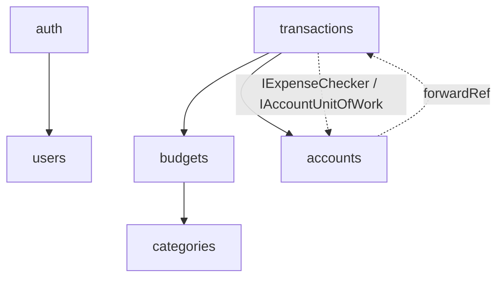

# Personal Finance API

> A personal-finance REST API built to get the hard part right: **money that stays
> correct under concurrent writes.** NestJS + PostgreSQL + Redis, strict DDD / Clean
> architecture, with every multi-aggregate invariant protected by a Unit of Work and
> pessimistic row locks.

<p>
  
  
  
  
  
  
  
</p>

## See it running

**Live demo (Railway):**

- **Swagger UI:** https://personal-finance-api-production-cbfe.up.railway.app/api/docs
- **Demo login:** `demo-recruiter@finanzas.dev` / `DemoRecruiter2026!` — call
  `POST /auth/login`, click *Authorize* with the `accessToken`, and browse a seeded
  month of data: two accounts, four budgets (one exactly at 100% of its limit — one
  more peso on it returns a 422) and a month of transactions.
- **Guided tour:** [`requests/demo-flow.http`](requests/demo-flow.http) walks the whole
  API in 18 chained requests — including the budget gate rejecting an over-limit
  expense (422) and refresh-token **replay detection** revoking an entire token family.

The API also documents itself locally: every controller is decorated for **Swagger /
OpenAPI**, so the same browsable, executable contract lives at `/api/docs` on any
running instance (see [Run it locally](#run-it-locally) — two commands and it's up).
Demo data is reproducible: `npm run seed:demo` ([scripts/seed-demo.mjs](scripts/seed-demo.mjs))
seeds through the public API, so it can never produce a state the domain wouldn't allow.

---

## The problem (and why it isn't trivial)

A finance backend is easy to build and hard to make **correct**. The interesting bugs
aren't CRUD — they're concurrency: two requests spending against the same budget at the
same time, a balance updated twice, a budget deleted while a transaction lands in its
period. This project treats those as the core engineering problem and closes them at the
database layer, not by hoping requests don't overlap.

## Engineering decisions

The decisions worth reviewing — each links to the code and, where written, an ADR.

### Concurrency-safe money — Unit of Work + pessimistic locks

Multi-aggregate, money-touching invariants (account balance, budget limit, period
spend) run inside a **request-scoped Unit of Work**: one `QueryRunner`, one PostgreSQL
transaction. Scoped repositories take `SELECT ... FOR UPDATE` on the rows that gate each
invariant, and the **budget row acts as a logical mutex** for "Σ period expenses ≤
limit". A catalogue of races (write skew, lost update, TOCTOU) is documented as
**reproduced and closed**.
→ [ADR-0002](docs/adr/0002-unit-of-work-pessimistic-locks.md) · [concurrency model](docs/concurrency-model.md) · [`create-transaction.use-case.ts`](src/modules/transactions/application/use-cases/create-transaction.use-case.ts)

### Strict DDD / Clean architecture

Three layers per module with dependencies pointing inward; the domain has **zero**
NestJS/TypeORM/HTTP imports. Ports are `abstract class` so they serve as both type and
DI token. Rich entities with private constructors and `create()` / `reconstitute()`
factories; immutable, self-validating value objects.
→ [architecture](docs/architecture.md) · [ADR-0001](docs/adr/0001-ports-as-abstract-classes.md)

### Refresh-token rotation with replay detection

Refresh tokens are persisted as `sha256(token)` (never plaintext), grouped into a
**family** per login. Every refresh rotates the token; a replayed token revokes the
**entire family** atomically. Login is timing-safe (constant-time even for unknown
emails) to prevent enumeration.
→ [ADR-0004](docs/adr/0004-refresh-token-rotation.md)

### Immutable, single-entry transactions

Transactions are immutable accounting records — no in-place update; corrections are
delete + recreate. The model is **single-entry** by design for V1 (documented honestly,
with trade-offs, not dressed up as a ledger it isn't).
→ [ADR-0005](docs/adr/0005-single-entry-immutable-transactions.md)

### Defense in depth & production hardening

Uniqueness enforced in three layers (DB constraint + `23505` catch → domain exception +
application pre-check). Helmet, env validation with Joi (fail-fast on missing prod
secrets), Redis-backed per-IP throttling, Prometheus metrics, structured logging,
liveness/readiness probes, multi-stage non-root Docker image, migrations run as a
release phase.
→ [deployment runbook](docs/deployment.md)

## Architecture at a glance

Dependencies flow one way; the `accounts ↔ transactions` cycle is resolved with a
"port owned by consumer" pattern. Full diagrams and request flow in
[docs/architecture.md](docs/architecture.md).



## Tech stack

| Layer | Choice |
| --- | --- |
| Runtime | Node 20, NestJS 11, TypeScript 5 |
| Persistence | PostgreSQL 15, TypeORM 0.3 (migrations) |
| Cache / rate-limit | Redis 7 (cache + throttler storage) |
| Auth | JWT access + rotating refresh, bcrypt, Passport |
| Validation | class-validator (HTTP), Joi (env) |
| Observability | Prometheus (`prom-client`), pino, Terminus health checks |
| Packaging | Docker (multi-stage, non-root, tini) |
| CI | GitHub Actions (lint, build, unit, integration, migration smoke, docker build, security audit) |

## Run it locally

**Requirements:** Docker Desktop, Node 20+

```bash
# 1. Environment
cp .env.example .env
# Generate the two JWT secrets (the app won't boot without them):
node -e "console.log('JWT_SECRET=' + require('crypto').randomBytes(64).toString('hex'))"
node -e "console.log('JWT_REFRESH_SECRET=' + require('crypto').randomBytes(64).toString('hex'))"
# Note: set DB_PORT=5433 in .env (the compose Postgres is published on 5433, not 5432).

# 2. Infrastructure (Postgres :5433 · Redis :6379 · pgAdmin :5051)
docker compose up -d

# 3. Install, migrate, run
npm install
npm run migration:run      # schema via migrations (synchronize is off by default)
npm run start:dev
```

- API → `http://localhost:3000/api/v1`
- Swagger → `http://localhost:3000/api/docs`
- Health / readiness → `http://localhost:3000/health` · `http://localhost:3000/ready`
- Metrics (Prometheus) → `http://localhost:3000/metrics`

## API overview

All routes except `/auth/*`, `/health` and `/ready` require a Bearer access token. The
acting user always comes from the JWT — never from the body or the URL.

| Resource | Endpoints |
| --- | --- |
| Auth | `POST /auth/register` · `POST /auth/login` · `POST /auth/refresh` · `POST /auth/logout` |
| Users | `GET /users/:id` · `PATCH /users/:id/profile` · `DELETE /users/:id` |
| Accounts | `POST /accounts` · `GET /accounts` · `GET /accounts/:id` · `PATCH /accounts/:id/{name,archive,unarchive}` · `DELETE /accounts/:id` |
| Categories | `POST /categories` · `GET /categories` · `GET /categories/:id` · `PATCH /categories/:id` · `DELETE /categories/:id` |
| Budgets | `POST /budgets` · `GET /budgets?month=&year=` · `GET /budgets/:id` · `PATCH /budgets/:id/limit` · `DELETE /budgets/:id` |
| Transactions | `POST /transactions` · `GET /transactions?page=&limit=&from=&to=` · `GET /transactions/:id` · `GET /transactions/account/:accountId` · `DELETE /transactions/:id` |

Domain rules surface as precise HTTP errors: spending over the budget limit is a `422`,
deleting a budget with expenses in its period is a `409`, operating on an archived
account is a `409`, touching another user's resource is a `403`. The full
exception-to-status table lives in [CLAUDE.md](CLAUDE.md).

## Testing

```bash
npm test                   # unit (domain + use cases), no DB
npm run test:integration   # integration against a real Postgres
npm run test:cov           # coverage
```

The suite includes a dedicated **concurrency** integration spec that drives the race
conditions above against a real database. Coverage thresholds are enforced in CI —
the domain layer is gated at **95% lines / 90% functions**.

## Roadmap

Ordered by intent, not by date. Items come from the documented gap analysis
([deployment runbook](docs/deployment.md), [observability](docs/observability.md),
module notes).

- **CD pipeline** — CI already builds the Docker image; publish it to a registry and
  deploy automatically on push to `main`.
- **Distributed tracing (OpenTelemetry)** — spans per request and per query; for a
  system built on pessimistic locks, seeing lock-wait time in production is the payoff.
- **Error tracking (Sentry)** — group and alert on unexpected 5xx; metrics and
  structured logs are already in place.
- **OAuth login (Google / GitHub)** — Passport strategies plugging into the existing
  auth architecture without touching the domain.
- **Email verification & password reset** — token flows backed by a queue (BullMQ) so
  sending mail never blocks the request.
- **Account-to-account transfers** — two linked transactions sharing a
  `transferGroupId`, atomic inside the existing Unit of Work.
- **Monthly reports endpoint** — spending summaries with CTEs and window functions.
- **User-deletion integration test** — verify the `CASCADE`/`RESTRICT` FK diamond
  before exposing hard delete to real users; consider soft delete.

## Documentation

| You want… | Read |
| --- | --- |
| The architecture & request flow | [docs/architecture.md](docs/architecture.md) |
| Why decisions were made | [docs/adr/](docs/adr/) |
| The concurrency model & lock map | [docs/concurrency-model.md](docs/concurrency-model.md) |
| The testing strategy (unit + integration) | [docs/testing.md](docs/testing.md) |
| Observability (logs, metrics, traces) | [docs/observability.md](docs/observability.md) |
| How to deploy | [docs/deployment.md](docs/deployment.md) |
| Per-module design notes | [src/modules/](src/modules/README.md) |
| How the hard bugs were found and closed | [docs/history/](docs/history/) |
| The exhaustive reference (patterns, rules, anti-patterns) | [CLAUDE.md](CLAUDE.md) |

## License

[MIT](LICENSE) © 2026 Vicente Cristobal Rivas Avello
