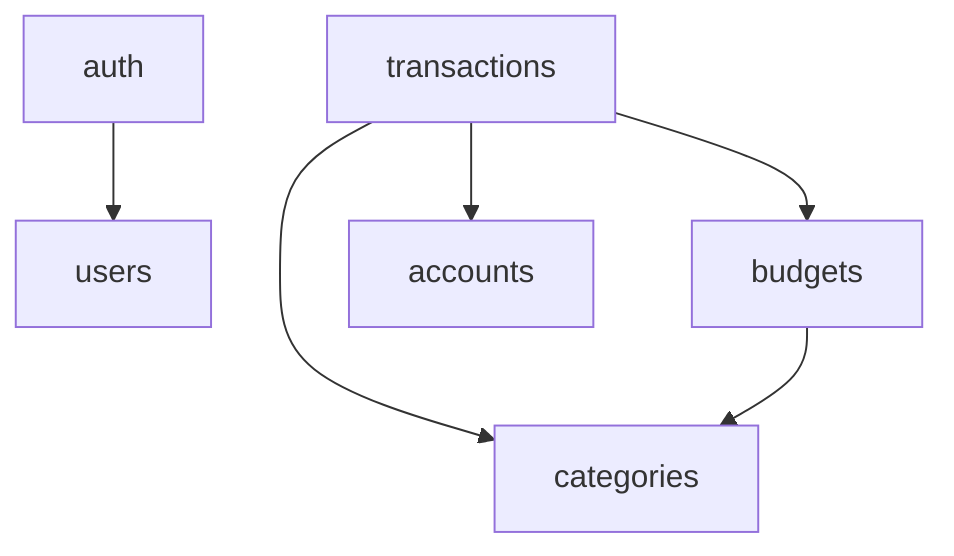

# Personal Finance API

> A personal-finance REST API built to get the hard part right: **money that stays
> correct under concurrent writes.** NestJS + PostgreSQL + Redis, strict DDD / Clean
> architecture, with every multi-aggregate invariant protected by a Unit of Work and
> pessimistic row locks.

<p>
  
  
  
  
  
  
  
</p>

Built by [Vicente Rivas Avello](https://www.linkedin.com/in/vicente-rivas-avello/) —
my first backend project. See [About this project](#about-this-project) for the context
and what I'd most want to be asked about.

## See it running

**Live demo (Railway):**

- **Swagger UI:** https://personal-finance-api-production-b32b.up.railway.app/api/docs
- **Demo login:** `demo-recruiter@finanzas.dev` / `DemoRecruiter2026!` — call
  `POST /auth/login`, click *Authorize* with the `accessToken`, and browse a seeded
  month of data: two accounts, four budgets (one exactly at 100% of its limit — one
  more peso on it returns a 422) and a month of transactions.
- **Guided tour:** [`requests/demo-flow.http`](requests/demo-flow.http) walks the whole
  API in 19 chained requests — including the budget gate rejecting an over-limit
  expense (422) and refresh-token **replay detection** revoking an entire token family.

The API also documents itself locally: every controller is decorated for **Swagger /
OpenAPI**, so the same browsable, executable contract lives at `/api/docs` on any
running instance (see [Run it locally](#run-it-locally) — two commands and it's up).
Demo data is reproducible: `npm run seed:demo` ([scripts/seed-demo.mjs](scripts/seed-demo.mjs))
seeds through the public API, so it can never produce a state the domain wouldn't allow.

---

## The problem (and why it isn't trivial)

A finance backend is easy to build and hard to make **correct**. The interesting bugs
aren't CRUD — they're concurrency: two requests spending against the same budget at the
same time, a balance updated twice, a budget deleted while a transaction lands in its
period. This project treats those as the core engineering problem and closes them at the
database layer, not by hoping requests don't overlap.

## Engineering decisions

The decisions worth reviewing — each links to the code and, where written, an ADR.

### Concurrency-safe money — Unit of Work + pessimistic locks

Multi-aggregate, money-touching invariants (account balance, budget limit, period
spend) run inside a **Unit of Work**: every `run()` call opens one `QueryRunner`, one
PostgreSQL transaction. Scoped repositories take `SELECT ... FOR UPDATE` on the rows
that gate each invariant, and the **budget row acts as a logical mutex** for "Σ period
expenses ≤ limit". Seven races (write skew, lost update, TOCTOU) are documented as
**reproduced and closed** — and the tests bite: removing a lock turns the matching test
red.
→ [ADR-0002](docs/adr/0002-unit-of-work-pessimistic-locks.md) · [concurrency model](docs/concurrency-model.md) · [`create-transaction.use-case.ts`](src/modules/transactions/application/use-cases/create-transaction.use-case.ts)

### Strict DDD / Clean architecture

Three layers per module with dependencies pointing inward; the domain has **zero**
NestJS/TypeORM/HTTP imports. Ports are `abstract class` so they serve as both type and
DI token. Rich entities with private constructors and `create()` / `reconstitute()`
factories; immutable, self-validating value objects.
→ [architecture](docs/architecture.md) · [ADR-0001](docs/adr/0001-ports-as-abstract-classes.md)

### Refresh-token rotation with replay detection

Refresh tokens are persisted as `sha256(token)` (never plaintext), grouped into a
**family** per login. Every refresh rotates the token; a replayed token revokes the
**entire family** atomically. Login is timing-safe (constant-time even for unknown
emails) to prevent enumeration.
→ [ADR-0004](docs/adr/0004-refresh-token-rotation.md)

### Immutable, single-entry transactions

Transactions are immutable accounting records — no in-place update; corrections are
delete + recreate. The model is **single-entry** by design for V1 (documented honestly,
with trade-offs, not dressed up as a ledger it isn't).
→ [ADR-0005](docs/adr/0005-single-entry-immutable-transactions.md)

### A read model with no domain layer (a documented exception)

`GET /reports/summary` aggregates already-persisted rows and enforces nothing, so
`reports` deliberately skips the `domain/` layer every other module has — no entities,
no value objects, no Unit of Work, no locks. One SQL statement means one MVCC snapshot,
so income and expenses come back mutually consistent without a transaction. The
"what counts as an expense" definition lives in a single DB view (`v_period_expenses`)
shared with the three budget-enforcement queries, so the reporting path and the
enforcement path can't disagree.
→ [`reports/notes.md`](src/modules/reports/notes.md)

### Measured, not assumed

A PostgreSQL performance lab on a **1,000,000-row** dataset: `EXPLAIN (ANALYZE, BUFFERS)`
against the query that guards the budget invariant, with the raw psql output committed
next to the script that produced it. An earlier "missing index" entry in the docs turned
out to be drift — the index existed, and the benchmark that proved it also killed the
proposed optimisation.
→ [PERFORMANCE.md](PERFORMANCE.md) · [period-sum index decision](docs/period-sum-index-decision.md)

### Defense in depth & production hardening

Uniqueness enforced in three layers (DB constraint + `23505` catch → domain exception +
application pre-check). Helmet, env validation with Joi (fail-fast on missing prod
secrets), Redis-backed per-IP throttling, Prometheus metrics, structured logging,
liveness/readiness probes, multi-stage non-root Docker image, migrations run as a
release phase.
→ [deployment runbook](docs/deployment.md)

## Architecture at a glance

Dependencies flow one way — every edge below is a direct import, zero `forwardRef()`
calls anywhere in the module graph. The two cycles that used to exist here
(`accounts ↔ transactions`, `budgets ↔ transactions`) both closed the same way: the
shared port's implementation moved into the module that owns the port, instead of
keeping a "port owned by consumer" cross-module split. Full diagrams and request flow
in [docs/architecture.md](docs/architecture.md).


```mermaid
graph TD
    auth[auth] --> users[users]
    transactions[transactions] --> budgets[budgets]
    transactions --> accounts[accounts]
    transactions --> categories[categories]
    budgets --> categories
```

## Tech stack

| Layer | Choice |
| --- | --- |
| Runtime | Node 20, NestJS 11, TypeScript 5 |
| Persistence | PostgreSQL 15, TypeORM 0.3 (migrations) |
| Cache / rate-limit | Redis 7 (cache + throttler storage) |
| Auth | JWT access + rotating refresh, bcrypt, Passport |
| Validation | class-validator (HTTP), Joi (env) |
| Observability | Prometheus (`prom-client`), pino, Terminus health checks |
| Packaging | Docker (multi-stage, non-root, tini) |
| CI | GitHub Actions (lint, build, unit, integration, migration smoke, docker build, security audit) |

## Run it locally

**Requirements:** Docker Desktop, Node 20+

```bash
# 1. Environment
cp .env.example .env
# Generate the two JWT secrets (the app won't boot without them):
node -e "console.log('JWT_SECRET=' + require('crypto').randomBytes(64).toString('hex'))"
node -e "console.log('JWT_REFRESH_SECRET=' + require('crypto').randomBytes(64).toString('hex'))"
# Note: set DB_PORT=5433 in .env (the compose Postgres is published on 5433, not 5432).

# 2. Infrastructure (Postgres :5433 · Redis :6379 · pgAdmin :5051)
docker compose up -d

# 3. Install, migrate, run
npm install
npm run migration:run      # schema via migrations (synchronize is off by default)
npm run start:dev
```

- API → `http://localhost:3000/api/v1`
- Swagger → `http://localhost:3000/api/docs`
- Health / readiness → `http://localhost:3000/health` · `http://localhost:3000/ready`
- Metrics (Prometheus) → `http://localhost:3000/metrics`

## API overview

All routes except `/auth/*`, `/health` and `/ready` require a Bearer access token. The
acting user always comes from the JWT — never from the body or the URL.

| Resource | Endpoints |
| --- | --- |
| Auth | `POST /auth/register` · `POST /auth/login` · `POST /auth/refresh` · `POST /auth/logout` |
| Users | `GET /users/:id` · `PATCH /users/:id/profile` · `DELETE /users/:id` |
| Accounts | `POST /accounts` · `GET /accounts` · `GET /accounts/:id` · `PATCH /accounts/:id/{name,archive,unarchive}` · `DELETE /accounts/:id` |
| Categories | `POST /categories` · `GET /categories` · `GET /categories/:id` · `PATCH /categories/:id` · `DELETE /categories/:id` |
| Budgets | `POST /budgets` · `GET /budgets?month=&year=` · `GET /budgets/:id` · `PATCH /budgets/:id/limit` · `DELETE /budgets/:id` |
| Transactions | `POST /transactions` · `GET /transactions?page=&limit=&from=&to=` · `GET /transactions/:id` · `GET /transactions/account/:accountId` · `DELETE /transactions/:id` |
| Reports | `GET /reports/summary?month=&year=` |

Domain rules surface as precise HTTP errors: spending over the budget limit is a `422`,
deleting a budget with expenses in its period is a `409`, operating on an archived
account is a `409`, touching another user's resource is a `403`. The full
exception-to-status table lives in [CLAUDE.md](CLAUDE.md).

## Testing

```bash
npm test                   # unit (domain + use cases), no DB
npm run test:integration   # integration against a real Postgres
npm run test:cov           # coverage
```

**635 unit tests** (78 suites, no DB) and **107 integration tests** (12 specs, real
Postgres + Redis). The suite includes a dedicated **concurrency** spec that drives the
races above against a real database and asserts on the *final state*, not on individual
responses — and each lock was verified by removing it and watching the matching test go
red. Coverage thresholds are enforced in CI; the domain layer is gated at **95% lines /
90% functions**.
→ [testing strategy](docs/testing.md)

## Roadmap

Ordered by intent, not by date. Items come from the documented gap analysis
([deployment runbook](docs/deployment.md), [observability](docs/observability.md),
module notes).

- **CD pipeline** — CI already builds the Docker image; publish it to a registry and
  deploy automatically on push to `main`.
- **Distributed tracing (OpenTelemetry)** — spans per request and per query; for a
  system built on pessimistic locks, seeing lock-wait time in production is the payoff.
- **Error tracking (Sentry)** — group and alert on unexpected 5xx; metrics and
  structured logs are already in place.
- **OAuth login (Google / GitHub)** — Passport strategies plugging into the existing
  auth architecture without touching the domain.
- **Email verification & password reset** — token flows backed by a queue (BullMQ) so
  sending mail never blocks the request.
- **Account-to-account transfers** — two linked transactions sharing a
  `transferGroupId`, atomic inside the existing Unit of Work. The one case single-entry
  genuinely doesn't cover ([ADR-0005](docs/adr/0005-single-entry-immutable-transactions.md)).
- **Global exception filter** — replace the per-controller `try/catch` mapping with one
  `@Catch()` filter, so a new domain exception can't fall through as a 500
  ([ADR-0006](docs/adr/0006-domain-exceptions-vs-http.md) records why it's deferred).
- **User-deletion integration test** — verify the `CASCADE`/`RESTRICT` FK diamond
  before exposing hard delete to real users; consider soft delete.

## Documentation

Full index: [docs/README.md](docs/README.md).

| You want… | Read |
| --- | --- |
| The architecture & request flow | [docs/architecture.md](docs/architecture.md) |
| Why decisions were made | [docs/adr/](docs/adr/) |
| The concurrency model & lock map | [docs/concurrency-model.md](docs/concurrency-model.md) |
| The testing strategy (unit + integration) | [docs/testing.md](docs/testing.md) |
| Query performance, measured | [PERFORMANCE.md](PERFORMANCE.md) |
| Observability (logs, metrics, traces) | [docs/observability.md](docs/observability.md) |
| How to deploy | [docs/deployment.md](docs/deployment.md) |
| Per-module design notes | [src/modules/](src/modules/README.md) |
| How the hard bugs were found and closed | [docs/history/](docs/history/) |
| The exhaustive reference (patterns, rules, anti-patterns) | [CLAUDE.md](CLAUDE.md) |

## About this project

My first backend project, built between **March and August 2026** while learning NestJS
and PostgreSQL. It started as a CRUD API and became a study of what breaks under
concurrent writes: reading *Designing Data-Intensive Applications* alongside it is what
made me stop asking *"does this work?"* and start asking *"what does this do when it
runs twice, at the same time?"*

Every design decision here is written down, including the ones that turned out wrong.
Four I'd want to be asked about — chosen for the judgement rather than the trivia:

- **Choosing not to use the more powerful tool.** `SERIALIZABLE` would close the write
  skew in one line. It was rejected because of *where it moves the failure*: into retry
  logic on every write path, with idempotency and backoff to get right, failing only
  under load. Targeted pessimistic locks keep the cost visible and local.
  ([ADR-0002](docs/adr/0002-unit-of-work-pessimistic-locks.md))
- **Making the dangerous mistake impossible instead of documenting it.** A scoped
  repository built on the wrong `EntityManager` compiles, runs, and returns
  correct-looking rows — Postgres grants the `FOR UPDATE` and releases it when the
  `SELECT` ends. Nothing throws, nothing logs, and no integration test catches it
  reliably. So the class is unexported and the only door is a factory that takes a
  `QueryRunner`: passing the wrong thing stops compiling.
  ([ADR-0009](docs/adr/0009-scoped-repositories-as-guarded-factories.md))
- **Superseding my own ADR.** [ADR-0003](docs/adr/0003-port-owned-by-consumer.md)
  rationalised a module cycle as a pattern. The cycle was an artefact of composition and
  the diagnosis was wrong;
  [ADR-0009](docs/adr/0009-scoped-repositories-as-guarded-factories.md) replaced it.
  Both are kept, and 0003 now states plainly why it was wrong.
- **Knowing where this is still fragile.** The lock model is correct today but relies on
  convention in two places the compiler cannot check: the acquisition order that makes it
  deadlock-free, and the agreement that every writer of period expenses takes the budget
  lock first. Both are documented as known debt rather than left for someone to discover.
  ([concurrency model §13](docs/concurrency-model.md))

**Vicente Cristobal Rivas Avello** · [LinkedIn](https://www.linkedin.com/in/vicente-rivas-avello/)

## License

[MIT](LICENSE) © 2026 Vicente Cristobal Rivas Avello
