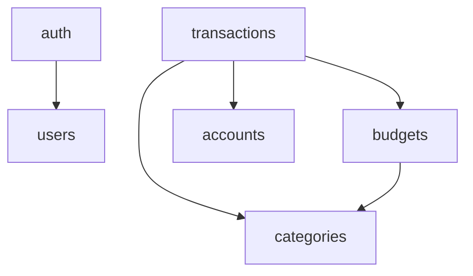

# Personal Finance API

Laboratorio de ingeniería backend construido con NestJS, PostgreSQL y TypeORM, utilizado para experimentar con internals de bases de datos, concurrencia, testing, arquitectura y rendimiento. Aplica patrones y prácticas de diseño como Unit of Work, locks pesimistas de fila, DDD y Clean Architecture estricta.

<p>
  
  
  
  
  
  
  
</p>

Hecho por [Vicente Rivas Avello](https://www.linkedin.com/in/vicente-rivas-avello/) —
mi primer proyecto de backend.

> **Nota sobre el idioma.** Este README está en español; **toda la documentación técnica
> está en inglés a propósito** — los ADRs, el modelo de concurrencia, la arquitectura y
> las notas de cada módulo. La escribí así para practicar escritura técnica en inglés,
> que es el idioma en el que se documenta y se discute diseño en la mayoría de los
> equipos. Los términos de concurrencia que aparecen más abajo (*write skew*, *lost
> update*, *Unit of Work*) también van en inglés: traducirlos pierde precisión y no es
> como se buscan.

## Verlo funcionando

Demo desplegada en Railway:

- **Swagger UI:** https://personal-finance-api-production-b32b.up.railway.app/api/docs
- **Login de demo:** `demo-recruiter@finanzas.dev` / `DemoRecruiter2026!` — sin esto,
  toda ruta protegida responde `401`.
- **Demo flow:** [`requests/demo-flow.http`](requests/demo-flow.http) — recorrido
  reproducible de la API con autenticación, presupuestos, transacciones y detección de
  replay de refresh tokens.

La API expone su contrato mediante Swagger / OpenAPI, por lo que todas las rutas pueden
explorarse y ejecutarse directamente desde `/api/docs`.

Para ejecutar el proyecto localmente, ver [Correrlo localmente](#correrlo-localmente).

## Sobre este proyecto

Mi proyecto/lab personal de backend, construido entre **marzo y agosto de 2026** mientras
aprendía NestJS y PostgreSQL. Empezó como una API CRUD y terminó siendo un estudio de
qué se rompe bajo escrituras concurrentes: leer *Designing Data-Intensive Applications*
en paralelo fue lo que me hizo dejar de preguntar *"¿esto funciona?"* y empezar a
preguntar *"¿qué hace esto cuando corre dos veces, al mismo tiempo?"*.

Los bugs interesantes acá no son de CRUD, son de
concurrencia. Un balance actualizado dos veces. Un presupuesto borrado mientras una
transacción cae en su período. Una transacción revertida dos veces porque llegaron dos
`DELETE` juntos.

Ninguno de esos se ve con un request a la vez, y ninguno se arregla revisando el código
con más cuidado. Se cierran en la capa de base de datos, o no se cierran — y por eso el
proyecto está organizado alrededor de ellos en lugar de alrededor de sus endpoints.

Cada decisión de diseño está escrita, incluidas las que resultaron equivocadas.

**Vicente Cristóbal Rivas Avello** · [LinkedIn](https://www.linkedin.com/in/vicente-rivas-avello/)

---

## La API

Todas las rutas salvo `/auth/*`, `/health` y `/ready` requieren un access token Bearer.
El usuario que actúa **siempre** sale del JWT — nunca del body ni de la URL.

Las reglas de dominio se traducen en errores HTTP precisos: gastar por encima del límite
del presupuesto es un `422`, borrar un presupuesto con gastos en su período es un `409`,
operar sobre una cuenta archivada es un `409`, y tocar el recurso de otro usuario es un
`403`. La tabla completa de excepción → status vive en [CLAUDE.md](CLAUDE.md).

## Decisiones de ingeniería

Las decisiones que vale la pena revisar — cada una enlaza al código y, donde está
escrito, a un ADR.

### Dinero seguro bajo concurrencia — Unit of Work + locks pesimistas

Los invariantes multi-agregado que tocan dinero (balance de la cuenta, límite del
presupuesto, gasto del período) corren dentro de un **Unit of Work**: cada llamada a
`run()` abre un `QueryRunner`, una transacción de PostgreSQL. Los repositorios scoped
toman `SELECT ... FOR UPDATE` sobre las filas que resguardan cada invariante, y la **fila
del presupuesto funciona como mutex lógico** de "Σ gastos del período ≤ límite". Siete
carreras (*write skew*, *lost update*, TOCTOU) están documentadas como **reproducidas y
cerradas** — y los tests muerden: sacar un lock pone en rojo el test correspondiente.
→ [ADR-0002](docs/adr/0002-unit-of-work-pessimistic-locks.md) · [modelo de concurrencia](docs/concurrency-model.md) · [`create-transaction.use-case.ts`](src/modules/transactions/application/use-cases/create-transaction.use-case.ts)

### DDD / Clean architecture estricta

Tres capas por módulo con las dependencias apuntando hacia adentro; el dominio tiene
**cero** imports de NestJS, TypeORM o HTTP. Los puertos son `abstract class` para servir
a la vez como tipo y como token de DI. Entidades ricas con constructor privado y
factories `create()` / `reconstitute()`; value objects inmutables y auto-validados.
→ [arquitectura](docs/architecture.md) · [ADR-0001](docs/adr/0001-ports-as-abstract-classes.md)

### Rotación de refresh tokens con detección de replay

Los refresh tokens se persisten como `sha256(token)` (nunca en texto plano), agrupados en
una **familia** por login. Cada refresh rota el token; un token replayeado revoca la
**familia entera** de forma atómica. El login es *timing-safe* (tiempo constante incluso
para emails que no existen) para evitar enumeración.
→ [ADR-0004](docs/adr/0004-refresh-token-rotation.md)

### Transacciones inmutables de partida simple

Las transacciones son registros contables inmutables — no hay update in-place; las
correcciones son borrar y recrear. El modelo es de **partida simple** por diseño en la
V1 (documentado con honestidad, con sus trade-offs, sin disfrazarlo de un libro contable
que no es).
→ [ADR-0005](docs/adr/0005-single-entry-immutable-transactions.md)

### Un read model sin capa de dominio (excepción documentada)

`GET /reports/summary` agrega filas ya persistidas y no impone ningún invariante, así que
`reports` se saltea a propósito la capa `domain/` que tienen todos los demás módulos — sin
entidades, sin value objects, sin Unit of Work, sin locks. Una sola sentencia SQL implica
un solo snapshot MVCC, así que ingresos y gastos vuelven mutuamente consistentes sin
abrir una transacción. La definición de "qué cuenta como gasto" vive en una única vista de
la base (`v_period_expenses`), compartida con las tres consultas que hacen cumplir los
presupuestos: el camino que reporta y el que impone el límite no pueden contradecirse.
→ [`reports/notes.md`](src/modules/reports/notes.md)

### Medido, no supuesto

Un laboratorio de performance de PostgreSQL sobre un dataset de **1.000.000 de filas**:
`EXPLAIN (ANALYZE, BUFFERS)` contra la consulta que resguarda el invariante del
presupuesto, con la salida cruda de psql commiteada al lado del script que la produjo. Una
entrada vieja en la documentación que hablaba de un "índice faltante" resultó ser deriva
— el índice ya existía, y el benchmark que lo demostró también mató la optimización que
se proponía.
→ [PERFORMANCE.md](PERFORMANCE.md) · [decisión sobre el índice del período](docs/period-sum-index-decision.md)

### Defensa en profundidad y hardening de producción

Unicidad garantizada en tres capas (constraint de base + catch de `23505` → excepción de
dominio + pre-chequeo en la aplicación). Helmet, validación de entorno con Joi (fail-fast
si falta un secreto en producción), throttling por IP respaldado en Redis, métricas
Prometheus, logging estructurado, probes de liveness y readiness, imagen Docker
multi-stage sin root, y migraciones que corren como fase de release.
→ [runbook de despliegue](docs/deployment.md)

## Arquitectura de un vistazo

Las dependencias fluyen en una sola dirección — cada arista de abajo es un import directo,
y no hay **ni un** `forwardRef()` en todo el grafo de módulos. Los dos ciclos que existían
acá (`accounts ↔ transactions`, `budgets ↔ transactions`) se cerraron de la misma forma:
la implementación del puerto compartido se mudó al módulo dueño del puerto, en vez de
sostener una división cruzada del tipo "puerto propiedad del consumidor". Diagramas
completos y flujo de request en [docs/architecture.md](docs/architecture.md).


```mermaid
graph TD
    auth[auth] --> users[users]
    transactions[transactions] --> budgets[budgets]
    transactions --> accounts[accounts]
    transactions --> categories[categories]
    budgets --> categories
```

## Stack

| Capa | Elección |
| --- | --- |
| Runtime | Node 20, NestJS 11, TypeScript 5 |
| Persistencia | PostgreSQL 15, TypeORM 0.3 (migraciones) |
| Caché / rate-limit | Redis 7 (caché + storage del throttler) |
| Auth | JWT access + refresh rotativo, bcrypt, Passport |
| Validación | class-validator (HTTP), Joi (entorno) |
| Observabilidad | Prometheus (`prom-client`), pino, health checks con Terminus |
| Empaquetado | Docker (multi-stage, sin root, tini) |
| CI | GitHub Actions (lint, build, unit, integración, migration smoke, docker build, security audit) |

## Correrlo localmente

**Requisitos:** Docker Desktop, Node 20+

```bash
# 1. Entorno
cp .env.example .env
# Generá los dos secretos JWT (la app no arranca sin ellos):
node -e "console.log('JWT_SECRET=' + require('crypto').randomBytes(64).toString('hex'))"
node -e "console.log('JWT_REFRESH_SECRET=' + require('crypto').randomBytes(64).toString('hex'))"
# Importante: usar DB_PORT=5433 en .env (el Postgres del compose se publica en 5433, no 5432).

# 2. Infraestructura (Postgres :5433 · Redis :6379 · pgAdmin :5051)
docker compose up -d

# 3. Instalar, migrar, correr
npm install
npm run migration:run      # el schema sale de migraciones (synchronize está apagado por defecto)
npm run start:dev
```

- API → `http://localhost:3000/api/v1`
- Swagger → `http://localhost:3000/api/docs`
- Health / readiness → `http://localhost:3000/health` · `http://localhost:3000/ready`
- Métricas (Prometheus) → `http://localhost:3000/metrics`

## Tests

```bash
npm test                   # unitarios (dominio + use cases), sin base
npm run test:integration   # integración contra un Postgres real
npm run test:cov           # cobertura
```

**635 tests unitarios** (78 suites, sin base) y **107 tests de integración** (12 specs,
Postgres + Redis reales). La suite incluye un spec dedicado a **concurrencia** que corre
las carreras de arriba contra una base real y asierta sobre el *estado final*, no sobre
las respuestas individuales — y cada lock se verificó sacándolo y viendo que el test
correspondiente se pusiera en rojo. Los umbrales de cobertura se imponen en CI; la capa
de dominio está gateada en **95% de líneas / 90% de funciones**.
→ [estrategia de testing](docs/testing.md)

---

## Documentación

**Toda la documentación técnica está en inglés, a propósito** — ver la nota sobre el
idioma al principio. Índice completo: [docs/README.md](docs/README.md).

| Si Quieres | Lee |
| --- | --- |
| La arquitectura y el flujo de un request | [docs/architecture.md](docs/architecture.md) |
| Por qué se tomó cada decisión | [docs/adr/](docs/adr/) |
| El modelo de concurrencia y el mapa de locks | [docs/concurrency-model.md](docs/concurrency-model.md) |
| La estrategia de testing (unitarios + integración) | [docs/testing.md](docs/testing.md) |
| Performance de queries, medida | [PERFORMANCE.md](PERFORMANCE.md) |
| Observabilidad (logs, métricas, traces) | [docs/observability.md](docs/observability.md) |
| Cómo desplegarlo | [docs/deployment.md](docs/deployment.md) |
| Notas de diseño por módulo | [src/modules/](src/modules/README.md) |
| Cómo se encontraron y cerraron los bugs difíciles | [docs/history/](docs/history/) |
| La referencia exhaustiva (patrones, reglas, anti-patrones) | [CLAUDE.md](CLAUDE.md) |

## Licencia

[MIT](LICENSE) © 2026 Vicente Cristóbal Rivas Avello
