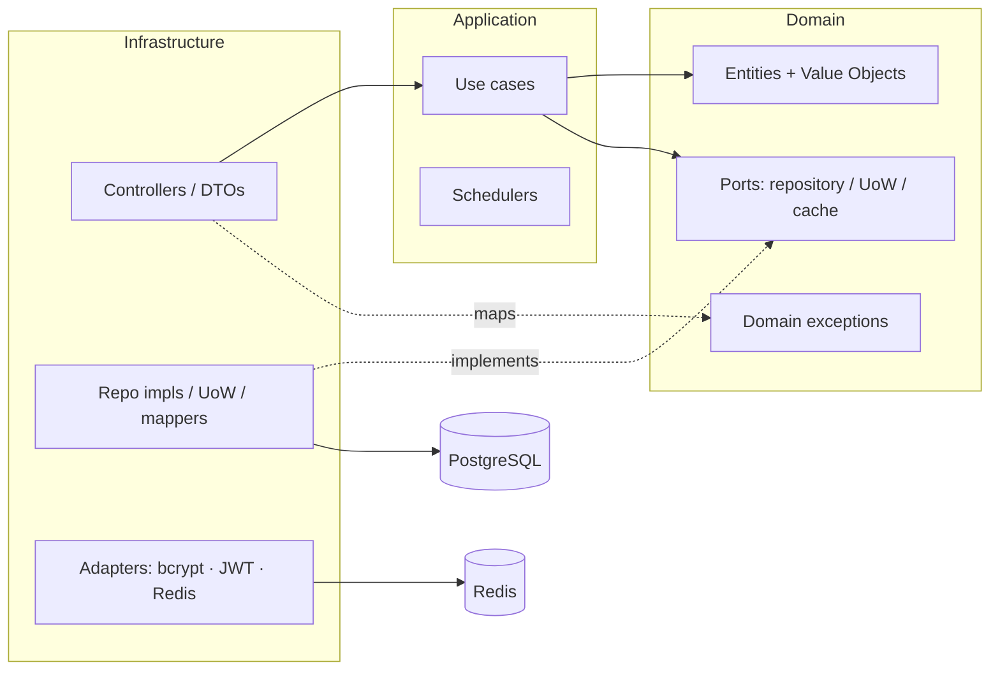
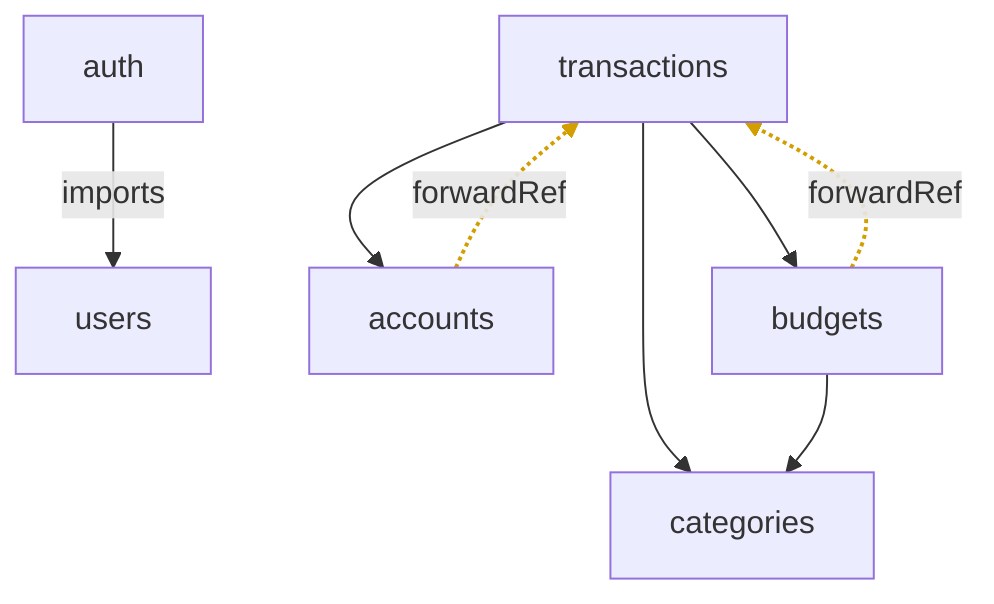
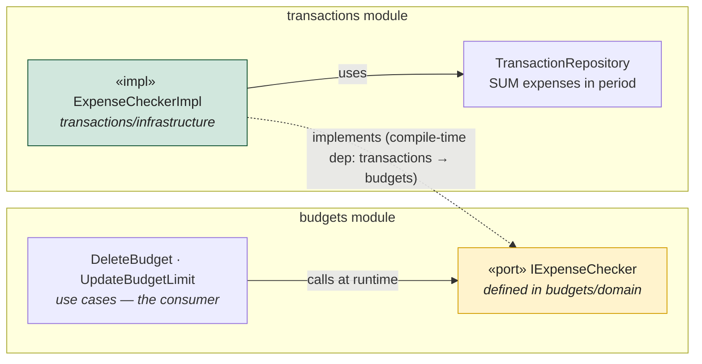
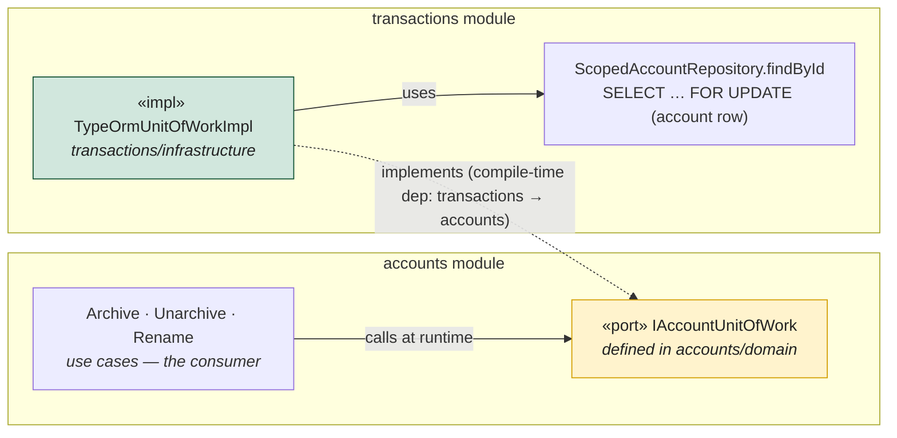
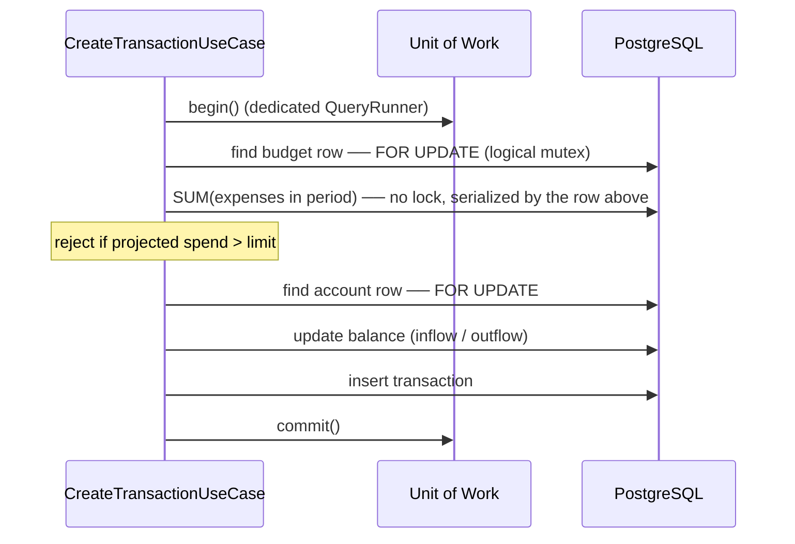
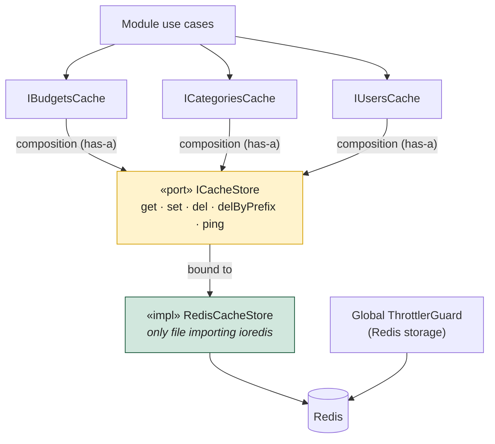

# Architecture

This is the technical entry point. It explains the layering, the module graph, and
how a money-mutating request flows through the system. For the _why_ behind specific
choices, see the [ADRs](./adr/). For the concurrency deep-dive, see
[`concurrency-model.md`](./concurrency-model.md).

## 1. Layering (DDD / Clean)

Every module has the same three-layer skeleton. Dependencies point **inward**: the
domain knows no one; application knows the domain; infrastructure knows both. The
domain never imports NestJS, TypeORM, or HTTP.

- **Domain** — pure: rich entities with private constructors and `create()` /
  `reconstitute()` factories, immutable self-validating value objects, ports as
  `abstract class` ([ADR-0001](./adr/0001-ports-as-abstract-classes.md)), and plain
  `Error` subclasses ([ADR-0006](./adr/0006-domain-exceptions-vs-http.md)).
- **Application** — one class per use case with a single `execute()`; `@Cron`
  schedulers (auth token cleanup today).
- **Infrastructure** — TypeORM entities + mappers + repository implementations, the
  Unit of Work, HTTP controllers/DTOs, and external adapters (incl. the only Redis client).

## 2. Module graph

Module-to-module dependencies, taken from each module's NestJS `imports`. A **solid**
edge is a direct import; a **dashed** edge is a `forwardRef()` that closes a dependency
cycle. `users` and `categories` are leaves (they import no other domain module).

There are two cycles — `accounts ↔ transactions` and `budgets ↔ transactions` — and
both are deliberate. `transactions` imports `accounts`/`budgets` to read accounts,
validate categories and check budgets; in the other direction, `accounts` and `budgets`
need behaviour that only `transactions` can provide. That reverse direction is handled
by the **port-owned-by-consumer** pattern (detailed for `budgets` in §2.1 and for
`accounts` in §2.2), not by a raw import of transactions' internals.

| Module | Responsibility |
| --- | --- |
| **auth** | Register, login, refresh (rotation + replay detection), logout. Global JWT guard with `@Public()` opt-out. Throttled 5/min. |
| **users** | User CRUD + bcrypt. Owns only its own profile. |
| **accounts** | Balance, account type; inflow/outflow/archive/unarchive. Archived accounts are read-only. |
| **categories** | `income`/`expense` nature (immutable). Budgetability derived from nature. |
| **budgets** | One budget per (user, category, month, year). Limit enforcement. |
| **transactions** | Immutable, single-entry records ([ADR-0005](./adr/0005-single-entry-immutable-transactions.md)). All creates/deletes run inside a Unit of Work. |

### 2.1 Port owned by consumer — how `budgets` depends on `transactions`

`budgets` needs to ask `transactions` a question — *"are there expenses in this period,
and how much?"* — to enforce its rules (`DeleteBudget`, `UpdateBudgetLimit`). But
`transactions` already imports `budgets`. A direct call back would be a hard cycle.

The fix: the **port is defined in the consumer's domain (`budgets`)**, and the
**implementation lives in the provider (`transactions`)**. So the compile-time
dependency points `transactions → budgets` (the impl imports the port), while the
runtime call points `budgets → transactions` (the use case calls the impl that DI
injected). `forwardRef()` lets NestJS wire the cycle. See
[ADR-0003](./adr/0003-port-owned-by-consumer.md).

> Read it as: **budgets owns the contract, transactions fulfils it.** At runtime the
> arrow you "feel" is `budgets → transactions`; at compile time the source arrow is the
> reverse (`transactions → budgets`). That inversion is the whole point — it keeps the
> domain dependency one-way while letting the two modules collaborate.

The **same shape** is used twice more, all implemented by `transactions`:

| Port (contract) | Owned by (domain) | Implemented by | Consumed by |
| --- | --- | --- | --- |
| `IExpenseChecker` | `budgets` | `transactions` (`ExpenseCheckerImpl`) | `DeleteBudget`, `UpdateBudgetLimit` |
| `IBudgetUnitOfWork` | `budgets` | `transactions` (`TypeOrmUnitOfWorkImpl`) | `UpdateBudgetLimit`, `DeleteBudget` |
| `IAccountUnitOfWork` | `accounts` | `transactions` (`TypeOrmUnitOfWorkImpl`) | `Archive`, `Unarchive`, `Rename` |

### 2.2 Why `accounts` depends on `transactions`

Same pattern, different invariant. `accounts` has three state-changing operations —
`archive`, `unarchive`, `rename` — that must serialize against a transaction mutating the
**same account row**. The sharp case: archiving an account is a TOCTOU race with a
concurrent `POST /transactions` ("Race 2"). Archived accounts are read-only, so if
`archive` commits while a `CreateTransaction` has already read the account as *active*,
the transaction would be applied to an account that is now archived — invariant violated.

The serialization point is the **account-row lock** (`SELECT ... FOR UPDATE`) that
`CreateTransaction` / `DeleteTransaction` already take. For the account operations to
compete for that *same* lock, they must run inside the *same* request-scoped Unit of Work
— and the only UoW implementation (`TypeOrmUnitOfWorkImpl`) lives in `transactions`,
because that module owns the driving need for the locks
([ADR-0002](./adr/0002-unit-of-work-pessimistic-locks.md)).

So the port `IAccountUnitOfWork` is **owned by `accounts/domain`** and **implemented in
`transactions/infrastructure`**; `accounts` imports `transactions` (via `forwardRef()`)
only to receive that binding. Compile-time arrow: `transactions → accounts`. Runtime
call (an `archive` taking the lock): `accounts → transactions`. Identical inversion to
the expense-checker in §2.1.

## 3. Concurrency: how a transaction is created safely

Cross-aggregate, money-touching invariants run inside a request-scoped Unit of Work
(one `QueryRunner` = one PostgreSQL transaction) and use `SELECT ... FOR UPDATE` to
serialize. The budget row is the **logical mutex** for the "Σ period expenses ≤ limit"
invariant. Full rationale: [ADR-0002](./adr/0002-unit-of-work-pessimistic-locks.md)
and [`concurrency-model.md`](./concurrency-model.md).

## 4. Caching & Redis

Redis serves two jobs: the **cache** and the **throttler storage** (so per-IP limits
hold across instances). The domain stays vendor-agnostic via two stacked ports:
per-module **semantic** caches (`IBudgetsCache`, …) that *compose* a minimal transport
port `ICacheStore`, whose single adapter `RedisCacheStore` is the only file that imports
`ioredis`. Use cases never touch the transport directly. Full rationale:
[ADR-0008](./adr/0008-redis-cache-ports.md) and
[`cache-decision.md`](../src/shared/domain/cache-decision.md).

## 5. Cross-cutting infrastructure

- **AuthN/Z** — JWT access + DB-backed rotating refresh tokens
  ([ADR-0004](./adr/0004-refresh-token-rotation.md)); actor read from
  `@CurrentUser()`, never from body/URL.
- **Validation** — `class-validator` DTOs at the HTTP edge; `joi` validates env at
  boot (fail-fast on missing prod secrets).
- **Resilience/ops** — Redis-backed throttling, Prometheus metrics (`/metrics`),
  structured logging (pino), liveness (`/health`) and readiness (`/ready`) probes.
- **Schema** — migrations only ([ADR-0007](./adr/0007-migrations-over-synchronize.md)).

## 6. Where to read more

| Topic | Doc |
| --- | --- |
| Design decisions (the _why_) | [`adr/`](./adr/) |
| Concurrency model & lock map | [`concurrency-model.md`](./concurrency-model.md) |
| Cache design (composition vs inheritance) | [`cache-decision.md`](../src/shared/domain/cache-decision.md) |
| Deployment (build → release → run) | [`deployment.md`](./deployment.md) |