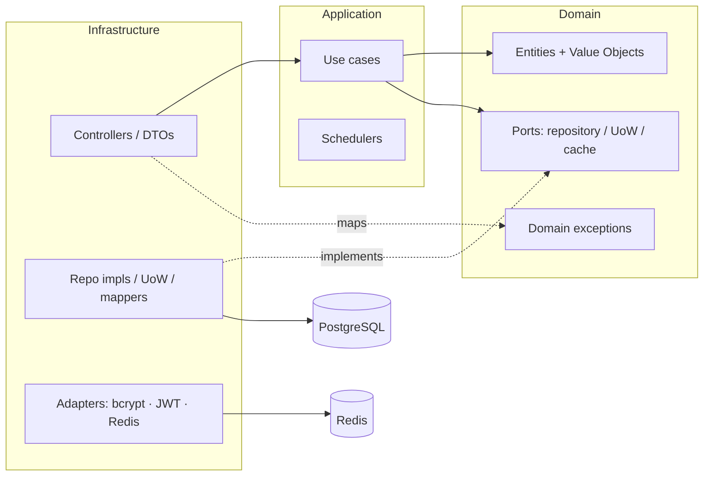
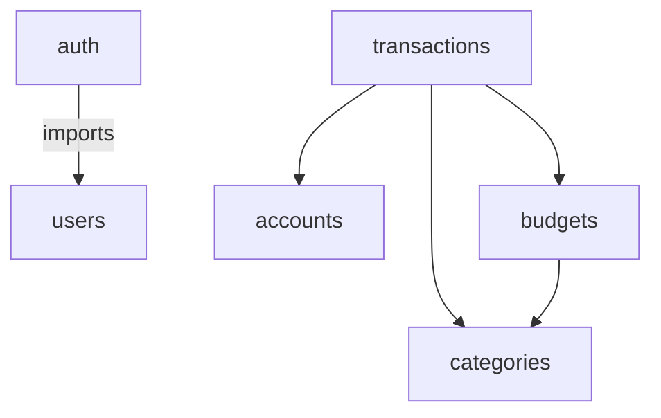
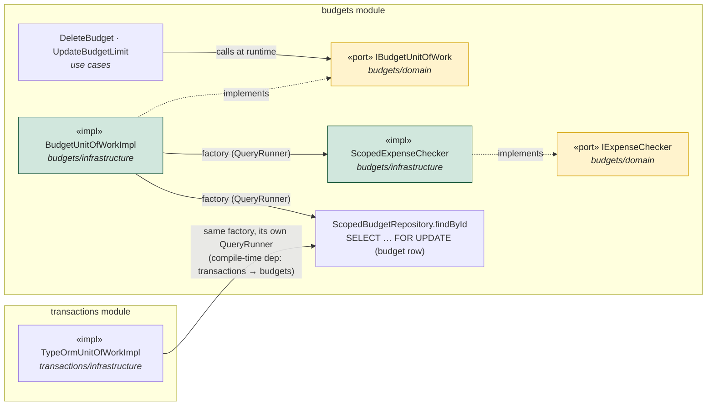
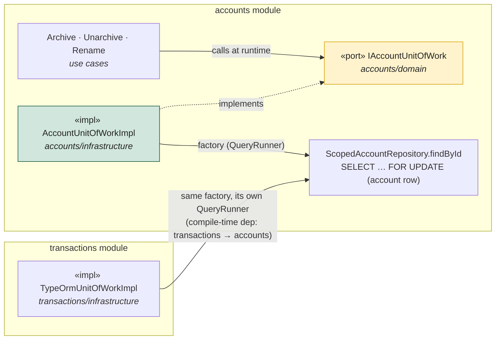
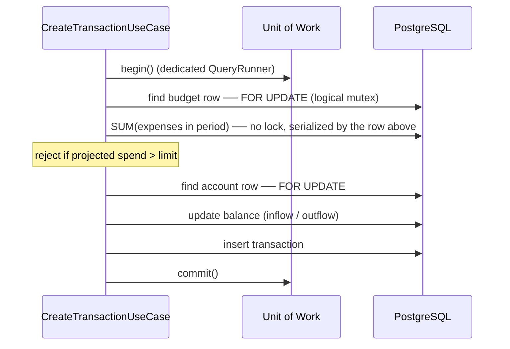
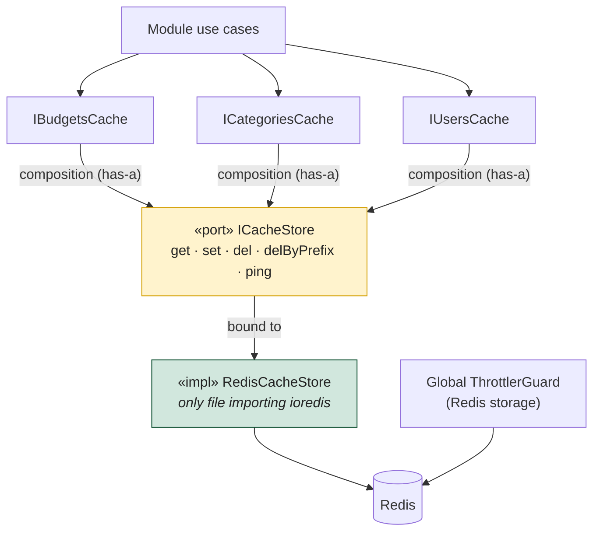

# Architecture

This is the technical entry point. It explains the layering, the module graph, and
how a money-mutating request flows through the system. For the _why_ behind specific
choices, see the [ADRs](./adr/). For the concurrency deep-dive, see
[`concurrency-model.md`](./concurrency-model.md).

## 1. Layering (DDD / Clean)

Every module has the same three-layer skeleton. Dependencies point **inward**: the
domain knows no one; application knows the domain; infrastructure knows both. The
domain never imports NestJS, TypeORM, or HTTP.

```mermaid
flowchart LR
    subgraph Infrastructure
        HTTP["Controllers / DTOs"]
        PERS["Repo impls / UoW / mappers"]
        ADP["Adapters: bcrypt · JWT · Redis"]
    end
    subgraph Application
        UC["Use cases"]
        SCH["Schedulers"]
    end
    subgraph Domain
        ENT["Entities + Value Objects"]
        PORT["Ports: repository / UoW / cache"]
        EXC["Domain exceptions"]
    end

    HTTP --> UC
    UC --> ENT
    UC --> PORT
    PERS -. implements .-> PORT
    HTTP -. maps .-> EXC
    PERS --> DB[("PostgreSQL")]
    ADP --> REDIS[("Redis")]
```

- **Domain** — pure: rich entities with private constructors and `create()` /
  `reconstitute()` factories, immutable self-validating value objects, ports as
  `abstract class` ([ADR-0001](./adr/0001-ports-as-abstract-classes.md)), and plain
  `Error` subclasses ([ADR-0006](./adr/0006-domain-exceptions-vs-http.md)).
- **Application** — one class per use case with a single `execute()`; `@Cron`
  schedulers (auth token cleanup today).
- **Infrastructure** — TypeORM entities + mappers + repository implementations, the
  Unit of Work, HTTP controllers/DTOs, and external adapters (incl. the only Redis client).

## 2. Module graph

Module-to-module dependencies, taken from each module's NestJS `imports`. Every edge
below is a **direct** import — there are **no cycles** and **no `forwardRef()`** calls
anywhere in the module graph. `users`, `categories`, `accounts` and `budgets` are
leaves (they import no other *domain* module; `budgets` still imports `categories`,
itself a leaf).

```mermaid
graph TD
    auth["auth"] -->|imports| users["users"]

    transactions["transactions"] --> accounts["accounts"]
    transactions --> categories["categories"]
    transactions --> budgets["budgets"]
    budgets --> categories
```

Both cycles that used to exist here are gone, and both closed the **same way**: not by
keeping the `forwardRef()` split, but by moving the shared port's implementation into
the module that owns the port, so the neighbour stops needing anything back from
`transactions` at all.

- The `accounts ↔ transactions` cycle **is gone** (§2.2): the provider for
  `IAccountUnitOfWork` used to be declared in `transactions.module.ts`, a token
  `transactions` itself never injected. `accounts` now owns `AccountUnitOfWorkImpl`
  and is a leaf; `transactions → accounts` remains, one-way.
- The `budgets ↔ transactions` cycle **is gone** (§2.1): the providers for
  `IBudgetUnitOfWork` and `IExpenseChecker` used to be declared in
  `transactions.module.ts` (well, `IExpenseChecker`'s impl lived there; `budgets`
  reached it via `forwardRef(() => TransactionsModule)`). `budgets` now owns
  `BudgetUnitOfWorkImpl` and is a leaf; `transactions → budgets` remains, one-way,
  because `CreateTransaction` is the one flow with a genuine multi-aggregate
  invariant (transaction + account + budget rows, one PostgreSQL transaction).

| Module | Responsibility |
| --- | --- |
| **auth** | Register, login, refresh (rotation + replay detection), logout. Global JWT guard with `@Public()` opt-out. Throttled 5/min. |
| **users** | User CRUD + bcrypt. Owns only its own profile. |
| **accounts** | Balance, account type; inflow/outflow/archive/unarchive. Archived accounts are read-only. |
| **categories** | `income`/`expense` nature (immutable). Budgetability derived from nature. |
| **budgets** | One budget per (user, category, month, year). Limit enforcement. |
| **transactions** | Immutable, single-entry records ([ADR-0005](./adr/0005-single-entry-immutable-transactions.md)). All creates/deletes run inside a Unit of Work. |

### 2.1 Why `budgets` does **not** depend on `transactions`

`budgets` used to need `transactions` for two things: the `IBudgetUnitOfWork`
transactional boundary, and an answer to *"are there expenses in this period, and how
much?"* (`IExpenseChecker`) to enforce `DeleteBudget` / `UpdateBudgetLimit`. Both used
to be implemented in `transactions/infrastructure/persistence/unit-of-work.impl.ts`,
reached from `budgets.module.ts` via `forwardRef(() => TransactionsModule)` — the
**"port owned by consumer"** pattern ([ADR-0003](./adr/0003-port-owned-by-consumer.md)):
`budgets` (the consumer) owned the port's domain contract, `transactions` (the
provider) supplied the implementation, and `forwardRef()` patched the resulting DI
cycle.

That pattern is the right tool when a genuine two-way dependency exists. Here it
didn't have to: neither `UpdateBudgetLimit` nor `DeleteBudget` ever needed anything
`transactions`-specific — they needed a transaction, a `FOR UPDATE` on the budget row,
and an aggregate read under that lock, all scoped to the budget aggregate alone. So
instead of keeping the cross-module split, `ScopedExpenseChecker` and
`BudgetUnitOfWorkImpl` moved into `budgets/infrastructure/persistence/`, next to the
port they serve. `budgets` no longer imports `transactions`, `forwardRef()` disappears,
and the DI graph goes from a patched cycle to a straight line.

```mermaid
flowchart LR
    subgraph budgets["budgets module"]
        direction TB
        BUC["DeleteBudget · UpdateBudgetLimit<br/><i>use cases</i>"]
        IBU["«port» IBudgetUnitOfWork<br/><i>budgets/domain</i>"]
        UOW["«impl» BudgetUnitOfWorkImpl<br/><i>budgets/infrastructure</i>"]
        IEC["«port» IExpenseChecker<br/><i>budgets/domain</i>"]
        ECI["«impl» ScopedExpenseChecker<br/><i>budgets/infrastructure</i>"]
        BLOCK["ScopedBudgetRepository.findById<br/>SELECT … FOR UPDATE (budget row)"]
        BUC -->|"calls at runtime"| IBU
        UOW -.->|implements| IBU
        UOW -->|"factory (QueryRunner)"| BLOCK
        UOW -->|"factory (QueryRunner)"| ECI
        ECI -.->|implements| IEC
    end

    subgraph transactions["transactions module"]
        direction TB
        TUOW["«impl» TypeOrmUnitOfWorkImpl<br/><i>transactions/infrastructure</i>"]
    end

    TUOW -->|"same factory, its own QueryRunner<br/>(compile-time dep: transactions → budgets)"| BLOCK

    classDef port fill:#fff3cd,stroke:#d39e00,color:#222;
    classDef impl fill:#d1e7dd,stroke:#0f5132,color:#222;
    class IBU,IEC port
    class UOW,ECI impl
```

This is the **same shape** §2.2 documents for accounts: the module that owns the
invariant (`budgets`) owns its scoped repository and its UoW; the one flow that
legitimately needs the same lock from outside (`CreateTransaction`, locking the budget
row before summing period expenses) reaches it through the same guarded factory,
`createScopedBudgetRepository(queryRunner, mapper)`, on its **own** `QueryRunner`. No
instance is shared — only the factory, and therefore the lock semantics.

| Port (contract) | Owned by (domain) | Implemented by | Consumed by |
| --- | --- | --- | --- |
| `IBudgetUnitOfWork` | `budgets` | `budgets` (`BudgetUnitOfWorkImpl`) | `UpdateBudgetLimit`, `DeleteBudget` |
| `IExpenseChecker` | `budgets` | `budgets` (`ScopedExpenseChecker`) | `DeleteBudget`, `UpdateBudgetLimit` |
| `IAccountUnitOfWork` | `accounts` | `accounts` (`AccountUnitOfWorkImpl`) | `Archive`, `Unarchive`, `Rename` |

All three module-specific UoW-adjacent ports are now implemented **inside their own
module** — the "port owned by consumer" pattern (§2.1 as originally written, before
this section was rewritten) no longer has a live example in this codebase. It stays
documented in [ADR-0003](./adr/0003-port-owned-by-consumer.md) as the correct fix
*if* a genuine cross-module dependency reappears.

### 2.2 Why `accounts` does **not** depend on `transactions`

`accounts` has three state-changing operations — `archive`, `unarchive`, `rename` — that
must serialize against a transaction mutating the **same account row**. The sharp case:
archiving an account is a TOCTOU race with a concurrent `POST /transactions` ("Race 2").
Archived accounts are read-only, so if `archive` commits while a `CreateTransaction` has
already read the account as *active*, the transaction would be applied to an account that
is now archived — invariant violated.

The serialization point is the **account-row lock** (`SELECT ... FOR UPDATE`). This module
originally received `IAccountUnitOfWork` from `transactions`, on the belief that competing
for the *same* lock required the *same* UoW instance. That belief was wrong, and it was
what closed the cycle.

`Scope.REQUEST` already means **one instance per request**: an `archive` request and a
`POST /transactions` request always had distinct instances, distinct `QueryRunner`s and
distinct DB transactions. What serializes them is Postgres holding the row lock until
commit — visible to any concurrent transaction, on any connection. Sharing the class never
entered into it.

So `accounts` implements its own `AccountUnitOfWorkImpl` and imports nothing. The single
`ScopedAccountRepository` — with the `FOR UPDATE` — lives in `accounts/infrastructure` and
is reached through a factory that takes a `QueryRunner`; `transactions` composes it on its
own runner for the multi-aggregate boundary. One arrow remains, `transactions → accounts`,
and it carries real domain weight.

```mermaid
flowchart LR
    subgraph accounts["accounts module"]
        direction TB
        AUC["Archive · Unarchive · Rename<br/><i>use cases</i>"]
        IAU["«port» IAccountUnitOfWork<br/><i>accounts/domain</i>"]
        UOW["«impl» AccountUnitOfWorkImpl<br/><i>accounts/infrastructure</i>"]
        LOCK["ScopedAccountRepository.findById<br/>SELECT … FOR UPDATE (account row)"]
        AUC -->|"calls at runtime"| IAU
        UOW -.->|implements| IAU
        UOW -->|"factory (QueryRunner)"| LOCK
    end

    subgraph transactions["transactions module"]
        direction TB
        TUOW["«impl» TypeOrmUnitOfWorkImpl<br/><i>transactions/infrastructure</i>"]
    end

    TUOW -->|"same factory, its own QueryRunner<br/>(compile-time dep: transactions → accounts)"| LOCK

    classDef port fill:#fff3cd,stroke:#d39e00,color:#222;
    classDef impl fill:#d1e7dd,stroke:#0f5132,color:#222;
    class IAU port
    class UOW impl
```

## 3. Concurrency: how a transaction is created safely

Cross-aggregate, money-touching invariants run inside a request-scoped Unit of Work
(one `QueryRunner` = one PostgreSQL transaction) and use `SELECT ... FOR UPDATE` to
serialize. The budget row is the **logical mutex** for the "Σ period expenses ≤ limit"
invariant. Full rationale: [ADR-0002](./adr/0002-unit-of-work-pessimistic-locks.md)
and [`concurrency-model.md`](./concurrency-model.md).

```mermaid
sequenceDiagram
    participant UC as CreateTransactionUseCase
    participant UoW as Unit of Work
    participant PG as PostgreSQL

    UC->>UoW: begin() (dedicated QueryRunner)
    UC->>PG: find budget row  ── FOR UPDATE (logical mutex)
    UC->>PG: SUM(expenses in period)  ── no lock, serialized by the row above
    note over UC: reject if projected spend > limit
    UC->>PG: find account row  ── FOR UPDATE
    UC->>PG: update balance (inflow / outflow)
    UC->>PG: insert transaction
    UC->>UoW: commit()
```

## 4. Caching & Redis

Redis serves two jobs: the **cache** and the **throttler storage** (so per-IP limits
hold across instances). The domain stays vendor-agnostic via two stacked ports:
per-module **semantic** caches (`IBudgetsCache`, …) that *compose* a minimal transport
port `ICacheStore`, whose single adapter `RedisCacheStore` is the only file that imports
`ioredis`. Use cases never touch the transport directly. Full rationale:
[ADR-0008](./adr/0008-redis-cache-ports.md) and
[`cache-decision.md`](../src/shared/domain/cache-decision.md).

```mermaid
flowchart TB
    UC["Module use cases"]
    IBC["IBudgetsCache"]
    ICC["ICategoriesCache"]
    IUC["IUsersCache"]
    ICS["«port» ICacheStore<br/>get · set · del · delByPrefix · ping"]
    RCS["«impl» RedisCacheStore<br/><i>only file importing ioredis</i>"]
    THR["Global ThrottlerGuard<br/>(Redis storage)"]
    REDIS[("Redis")]

    UC --> IBC & ICC & IUC
    IBC & ICC & IUC -->|"composition (has-a)"| ICS
    ICS -->|"bound to"| RCS
    RCS --> REDIS
    THR --> REDIS

    classDef port fill:#fff3cd,stroke:#d39e00,color:#222;
    classDef impl fill:#d1e7dd,stroke:#0f5132,color:#222;
    class ICS port
    class RCS impl
```

## 5. Cross-cutting infrastructure

- **AuthN/Z** — JWT access + DB-backed rotating refresh tokens
  ([ADR-0004](./adr/0004-refresh-token-rotation.md)); actor read from
  `@CurrentUser()`, never from body/URL.
- **Validation** — `class-validator` DTOs at the HTTP edge; `joi` validates env at
  boot (fail-fast on missing prod secrets).
- **Resilience/ops** — Redis-backed throttling, Prometheus metrics (`/metrics`),
  structured logging (pino), liveness (`/health`) and readiness (`/ready`) probes.
- **Schema** — migrations only ([ADR-0007](./adr/0007-migrations-over-synchronize.md)).

## 6. Where to read more

| Topic | Doc |
| --- | --- |
| Design decisions (the _why_) | [`adr/`](./adr/) |
| Concurrency model & lock map | [`concurrency-model.md`](./concurrency-model.md) |
| Cache design (composition vs inheritance) | [`cache-decision.md`](../src/shared/domain/cache-decision.md) |
| Deployment (build → release → run) | [`deployment.md`](./deployment.md) |