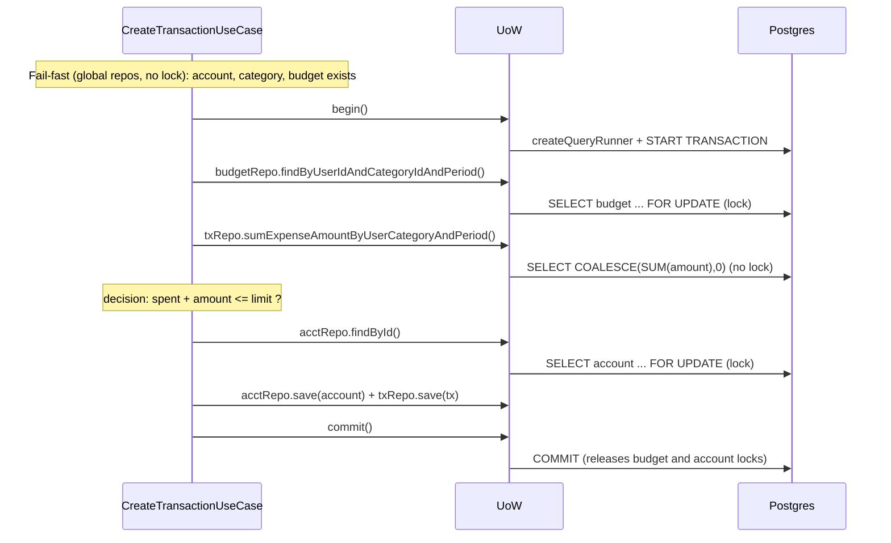
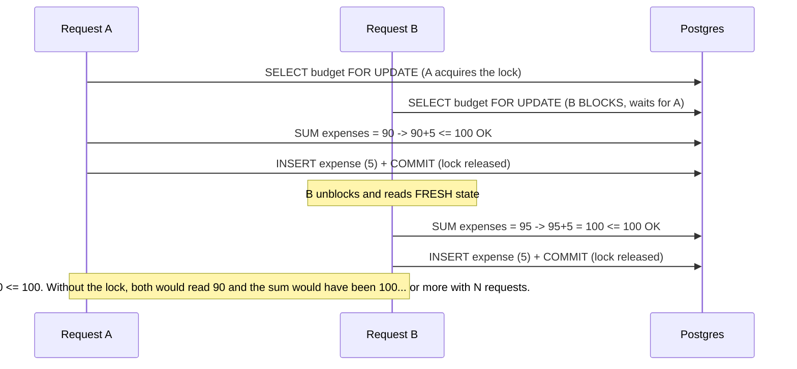

# Concurrency model

> Reference and study document. Gathers in one place what is fragmented across
> [CLAUDE.md](../CLAUDE.md) (the authoritative lock map), [uow-decision.md](../src/shared/domain/uow-decision.md)
> (the pattern), [race-conditions-fix-2026-05.md](./history/race-conditions-fix-2026-05.md) (cross-module
> post-mortems) and each module's `notes.md`. When the code and this doc disagree, the code
> wins — but open a PR to fix the doc.

---

## The model in one sentence

**Strong consistency on writes (targeted pessimistic locks), relaxed consistency on
reads (benign stale reads).** The coordination cost is paid only where a mistake costs money;
whatever is merely displayed stays cheap.

---

## 1. Isolation level

**`READ COMMITTED`** — PostgreSQL's default. The system does **not** raise it to `REPEATABLE READ` or
`SERIALIZABLE`. This is a decision, not an oversight:

- `SERIALIZABLE` would detect conflicts at commit time and abort with `40001` — but it would force
  the application to implement **retries**.
- Instead, the system **manufactures serialization where it needs it** with explicit pessimistic
  locks on specific rows. It doesn't ask Postgres for global isolation; it builds it point by point.

Expected consequence of `READ COMMITTED`: within the same tx, two reads of the same row can
see different values (*non-repeatable reads*) and *phantoms* appear (new rows in a range). The
design neutralizes this by funneling every writer through a guardian row, not by raising the isolation level.

---

## 2. The two mechanisms

| Concurrency problem | Mechanism | Where it lives |
| --- | --- | --- |
| **read-modify-write** (lost update, write skew) | `SELECT … FOR UPDATE` (pessimistic row lock) | scoped repos, inside the UoW |
| **check-then-insert** (duplicates) | unique constraint + `catch 23505` → domain exception | global repos (`save()`) |

Mental rule: **read-modify-write → lock. check-then-insert → constraint.** Never the other way
around — you cannot lock a row that doesn't exist yet, so uniqueness is guaranteed by the DB, not by a lock.

The pessimistic lock is taken when the row is **read** and is **held until `COMMIT`/`ROLLBACK`**
(two-phase locking) — not until the query returns. That is what covers the subsequent write:
between the `findById` and the `commit`, the row is locked for everyone else.

> That is why the scoped repos run on the `QueryRunner`'s `manager` (open tx) and **not** on the
> global `DataSource` (autocommit). In autocommit the `FOR UPDATE` would be released as soon as the SELECT
> finishes and would be useless. See the anti-pattern in CLAUDE.md: *"Do not read inside an open UoW with the global repository."*

---

## 3. The transactional boundary — Unit of Work

Two concrete implementations, separated by **atomic operation**, not by module:

- **`TypeOrmUnitOfWorkImpl`** (`transactions/infrastructure/persistence/unit-of-work.impl.ts`) —
  satisfies 3 ports (`ITransactionUnitOfWork`, `IBudgetUnitOfWork`, `IAccountUnitOfWork`) via
  `useExisting`. One `Scope.REQUEST` instance → one `QueryRunner` → one PG transaction shared
  by the three financial modules.
- **`AuthUnitOfWorkImpl`** (`auth/infrastructure/`) — separate: refresh-token rotation shares no
  invariant with the financial aggregates.

A single financial impl because **every multi-aggregate invariant in the domain is anchored to a
`Transaction` mutation** (balance, limit, period sum). The three ports are three *roles* of the
same transactional engine; `useExisting` expresses "same object, three narrow contracts". Pattern
details in [uow-decision.md](../src/shared/domain/uow-decision.md).

---

## 4. Lock map

| Read (scoped) | Lock | Serializes |
| --- | --- | --- |
| `ScopedAccountRepository.findById` | **FOR UPDATE** | Balance mutations: Create/DeleteTransaction + Archive/Unarchive/Rename (Race 2, Bug B) |
| `ScopedBudgetRepository.findById` | **FOR UPDATE** | UpdateBudgetLimit, DeleteBudget vs concurrent creates |
| `ScopedBudgetRepository.findByUserIdAndCategoryIdAndPeriod` | **FOR UPDATE** | The period-invariant gate in CreateTransaction (Bug A) |
| `ScopedTransactionRepository.findById` | **FOR UPDATE** | Double DELETE of the same tx (Race 3) |
| `ScopedRefreshTokenRepository.findByTokenHashWithLock` | **FOR UPDATE** | Two `/refresh` with the same token → replay detection |
| `sumExpenseAmountByUserCategoryAndPeriod` | **no lock** (aggregate) | Serialized by the budget lock taken beforehand |
| `ScopedExpenseChecker.hasExpensesInPeriod` / `sumExpenseAmountInPeriod` | **no lock** (aggregate) | Serialized by the budget lock of Delete/Update |

Aggregates (`SUM`/`COUNT`) **cannot** take `FOR UPDATE` (Postgres forbids it) and it wouldn't
help anyway: a lock on existing rows does not stop *phantom inserts* in the range. Their consistency
comes from the guardian-row lock that the caller takes **first**.

---

## 5. One mutex per invariant (not a global mutex)

There is no single "the mutex". **Each invariant has its own guardian row**, and a flow takes one lock per
invariant it mutates:

| Invariant | Guardian row | Locked by |
| --- | --- | --- |
| Σ period expenses ≤ limit | `budgets` row for the period | CreateTransaction, UpdateBudgetLimit, DeleteBudget |
| Correct account balance | `accounts` row | CreateTransaction, DeleteTransaction, Archive/Unarchive/Rename |
| No double-reverse of a tx | `transactions` row | DeleteTransaction |
| No refresh-token replay | `refresh_tokens` row | RefreshToken |

That is why `CreateTransaction` takes **two** locks (budget + account): it crosses two invariants. The
budget lock does **not** protect the balance — other flows (`Archive`, `DeleteTransaction`) mutate the
account without touching the budget, so if you didn't take the account lock, a concurrent `Archive`
would cause a lost update on the balance. Each row protects against a different set of competitors.

---

## 6. The skeleton of every transactional flow

```
1. Fail-fast OUTSIDE the UoW (global repo, no lock): cheap 404/403/400, grabs no connection
2. begin()                          — opens QueryRunner + tx
3. findById with FOR UPDATE         — takes the guardian-row lock
4. dependent reads                  — aggregates; inherit the exclusion from the lock in (3)
5. invariant decision               — with data read AFTER the lock
6. save() / delete()                — writes, still under the lock
7. commit() / rollback() in finally — only here are ALL the locks released
```

The 3→6 ordering **is** the correctness. Locking the guardian row *before* reading the data that
feeds the decision is what closes the race window.

---

## 7. The critical flows

### `CreateTransaction` (takes TWO locks)

1. **Outside the UoW:** creates `Amount`/`Nature` VOs; validates account exists+owned; validates category
   exists+owned and `nature` matches (R7); if expense, validates a budget exists for the period (global,
   no lock). Fail-fast: 404/403/400 without opening a connection.
2. `begin()`.
3. **LOCK budget** (expense only): `budgetRepo.findByUserIdAndCategoryIdAndPeriod` → `FOR UPDATE`.
4. **Dependent read:** `txRepo.sumExpenseAmountByUserCategoryAndPeriod` (no lock, post-gate).
5. **Decision:** `spent + amount ≤ limit`? if not → `BudgetLimitExceededException` (422).
6. **LOCK account** + write: `updateBalance` → `acctRepo.findById FOR UPDATE` → recomputes → `save`.
   Then `txRepo.save(transaction)`.
7. `commit` / `rollback` in finally.

### `DeleteTransaction`

1. **Outside the UoW:** `GetTransactionByIdUseCase` (global) → cheap 404/403.
2. `begin()`.
3. **LOCK transaction:** `txRepo.findById(id)` → `FOR UPDATE`. If null (someone else deleted it and committed) →
   `TransactionNotFoundException`.
4. —
5. **Decision:** reversing an income would leave a negative balance → `CannotDeleteTransactionException` (409).
6. **LOCK account** + write: `updateBalance` (reverse) → `acctRepo.findById FOR UPDATE`; `txRepo.delete`.
7. `commit` / `rollback`.

### `UpdateBudgetLimit`

1. — (inline ownership).
2. `begin()`.
3. **LOCK budget:** `budgetRepo.findById FOR UPDATE`; inline ownership.
4. **Dependent read:** `expenseChecker.sumExpenseAmountInPeriod` (no lock, under the budget lock).
5. **Decision:** `new limit < spent` → `BudgetLimitBelowSpentException` (409) [B4].
6. `budgetRepo.save`.
7. `commit` / `rollback`.

### `DeleteBudget`

1. — (inline ownership).
2. `begin()`.
3. **LOCK budget:** `budgetRepo.findById FOR UPDATE`; inline ownership.
4. **Dependent read:** `expenseChecker.hasExpensesInPeriod` (no lock, under the budget lock).
5. **Decision:** there are expenses in the period → `BudgetHasTransactionsInPeriodException` (409) [Race 1].
6. `budgetRepo.delete`.
7. `commit` / `rollback`.

### `Archive` / `Unarchive` / `Rename` account (all three, identical skeleton)

1. — (inline ownership).
2. `begin()`.
3. **LOCK account:** `accountRepo.findById FOR UPDATE`; inline ownership. Competes for the same row as
   Create/DeleteTransaction [Race 2].
4. —
5. **Decision:** domain method (`archive()` throws if already archived, etc.).
6. `accountRepo.save`.
7. `commit` / `rollback`.

### `RefreshToken` (auth — separate UoW)

1. **Outside the UoW:** verifies the token signature (`ITokenProvider`) — fail-fast without touching the DB.
2. `begin()`.
3. **LOCK refresh-token:** `findByTokenHashWithLock FOR UPDATE`.
4. —
5. **Decision:** null → `InvalidRefreshToken`; revoked → replay → `revokeFamily` + **commit** +
   `RefreshTokenReplayDetected`; expired → `RefreshTokenExpired`.
6. Inserts the new one (same `familyId`), revokes the old one (`replacedById = new jti`). Inserts **before**
   revoking, because of the self-referential FK.
7. `commit` / `rollback`.

> **Latent bug (noted, not active):** the **global** impl `RefreshTokenRepositoryImpl.findByTokenHashWithLock`
> also requests `pessimistic_write`. Outside a `QueryRunner` (autocommit connection) that would throw
> `PessimisticLockTransactionRequiredError`. It doesn't blow up because it is dead code: only the scoped
> one (`ScopedRefreshTokenRepository`, inside the UoW) calls it. Rule: never call `findByTokenHashWithLock`
> on the global repo.

---

## 8. Lock ordering and deadlocks

When a flow takes **more than one** lock, the order matters: two flows taking the same two locks in
opposite order can deadlock (A waits for B, B waits for A).

Acquisition order in the system:

- `CreateTransaction`: **budget → account**
- `DeleteTransaction`: **transaction → account**
- everything else: a single lock

No flow takes `account → budget` or `account → transaction`. In other words, **there is no order
inversion** on any pair of rows, so there is no deadlock by construction. If a multi-lock flow is added
in the future, it must respect the same order (the account row is locked **last**).

---

## 9. Consistency model: writes vs reads

### Writes → strong consistency

Every invariant mutation goes through the skeleton in §6: it re-reads under `FOR UPDATE` inside the UoW and
decides on fresh data. There is no path that writes a balance/limit "raw" without first
locking and re-reading. That is why the read-modify-writes are atomic by construction.

### Reads → benign stale reads (and that is the right call)

The **global** repos run in autocommit, `READ COMMITTED`, **without locks**. They can return stale
data — and that is fine, for three reasons:

1. **They can't break an invariant.** The invariant is enforced at *write* time, under lock, re-reading inside
   the UoW. A stale read **never feeds a write decision** → it can only end up on a
   screen. If it can't touch an invariant, there is nothing to fix.
2. **Serializing reads would be a performance disaster.** Reads outnumber writes by
   orders of magnitude. `FOR SHARE` on every read (or global `SERIALIZABLE`) would make readers
   block against writers and each other: you'd trade milliseconds of benign staleness for widespread
   contention.
3. **The window is tiny and self-healing.** It lasts as long as the tx (ms) and the next read sees the
   committed value.

**Mechanism detail:** a plain `SELECT` does **not** block against a row locked with `FOR UPDATE`.
In `READ COMMITTED`, readers don't block writers and vice versa. The staleness is not "the read waits and
returns old data"; it is "the read **does not wait** and returns the last committed value, ignoring the change in
flight".

**Read-your-own-writes:** staleness only appears between **concurrent** operations by different
actors. Your own sequential actions never see it: the mutation **commits before** the HTTP response
is sent, so your next `GET` already sees the new value.

### Where the stale read shows up

| Scenario | What you see |
| --- | --- |
| `GET /accounts/:id` while a transaction is being created (mid-flight) | The balance prior to the in-flight inflow/outflow |
| `GET /budgets` while an expense is being created | A `spent` lower than what it will be |
| `GET /transactions` after an uncommitted create from another request | The new tx doesn't show up yet |
| Fail-fast pre-checks (global repo) | May read stale — but they are re-verified under lock inside the UoW |

### If you ever need a consistent read

Don't raise the global isolation level. Do it **surgically**: that specific read inside a
`REPEATABLE READ` tx, or `FOR SHARE` on that query, or read it inside the same UoW. Rule: **relaxed by
default, strict only where it is proven to matter, and always local.**

---

## 10. Diagrams

### Happy path — `CreateTransaction` of an expense



### Two concurrent expenses in the same period (the lock serializes)



---

## 11. Historical races (all closed)

| ID | Scenario | Closure |
| --- | --- | --- |
| Bug A | `PATCH /budgets/:id/limit` vs `POST /transactions` (limit write skew) | `FOR UPDATE` on the budget row; create reads through the scoped repo |
| Bug B | Two `POST /transactions` on the same account (balance lost update) | `FOR UPDATE` on the account row |
| Bug E | Two `POST /auth/register` with the same email → 500 | `catch 23505` → `UserAlreadyExistsException` (409) |
| Race 1 | `DELETE /budgets/:id` vs `POST /transactions` (TOCTOU) | DeleteBudget under UoW; checker under the budget lock |
| Race 2 | `PATCH /accounts/:id/{archive,unarchive,name}` vs tx mutations | all three under `IAccountUnitOfWork`; `findById FOR UPDATE` |
| Race 3 | Two `DELETE /transactions/:id` (double-reverse) | `FOR UPDATE` on the tx row; fail-fast outside + re-fetch inside |
| B4 | `PATCH /budgets/:id/limit` could lower the limit below what was spent | sum under the budget lock → `BudgetLimitBelowSpentException` (409) |

Detailed post-mortems: [race-conditions-fix-2026-05.md](./history/race-conditions-fix-2026-05.md) (Race 1/2)
and each module's `notes-history.md` (Bug A/A.2/B, Bug E).

---

## 12. Concurrency tests

`test/integration/concurrency/concurrency.integration.spec.ts` against a real Postgres. The technique:
fire N requests with `Promise.all` and assert on the **final state**, not on each request.

- **Lost update:** N concurrent inflows → `currentBalance` must be the exact sum (if an update is
  lost, it comes out lower).
- **Invariant:** N expenses brushing the limit → only those that fit must pass (201), the rest 422.
- **Empty-period regression:** proves the serialization comes from the *budget* lock and not from locking
  pre-existing expense rows.
- **Two different operations:** `PATCH limit` vs `POST transaction` → exactly one wins; neither 500s.

A `500` under load almost always = deadlock or blown constraint → the serialization failed.

Validated on 2026-06-15: temporarily removing each lock makes the tests **go red** (account lock →
balance lost update; budget lock → limit exceeded + empty period; transaction lock → double reverse
in Race 3). In other words, the tests **bite** — they don't pass by accident.

---

## 13. Design fragility (known debt — to be addressed later)

The model is **correct but fragile-by-convention**: its correctness relies on human discipline, not on
guarantees enforced by the compiler or the tests. Three documented cracks to address later:

### 13.1 Implicit locks ("spooky action at a distance")

The `FOR UPDATE` lives *inside* the scoped repo's `findById`. From the call site (`budgetRepo.findById(id)`)
nothing indicates that the line takes an exclusive lock. Whoever reads the use case doesn't see the lock — they
have to know it or open the impl.

**Risk:** a contributor who adds a new write flow and reads with the **global** repo (instead
of the scoped one), or writes the balance/budget through a path that doesn't go through `findById`, **reopens the races
without anything detecting it**. The rule "don't read inside the UoW with the global repo" (CLAUDE.md) is the only
barrier, and it is prose, not code.

**Robust fix (future):** expose the lock in the name — `findByIdForUpdate()` on a scoped interface
(`IScopedAccountRepository extends IAccountRepository`) returned by the UoW. The lock becomes visible at
the call site and self-documenting. Cost: one scoped interface per aggregate.

### 13.2 Lock ordering not enforced (deadlock risk)

Today there is no deadlock because all flows take the locks in the same order (**budget → account**, the
account always last — see §8). But that order is a **convention in the head** of whoever wrote the
flows; nothing enforces it.

**Risk:** a future flow that takes `account → budget` introduces an AB-BA cycle. Postgres would detect it
(`deadlock_timeout` ~1s → aborts one tx with `40P01` → 500), but only in production and under load. The
compiler says nothing.

**Robust fix (future):** document the canonical order as a review rule + ideally a concurrency
test that exercises the pair of flows in reverse order to catch the regression.

### 13.3 The gate depends on *every* writer honoring it

The budget row serializes the period SUM **only because every writer of period expenses takes its
`FOR UPDATE` first** (the "talking stick" pattern). It is an agreement, not a physical enforcement: the budget
lock does not cover the `transactions` rows.

**Risk:** a flow that inserts an expense **without** going through the budget lock bypasses the gate and the
"Σ ≤ limit" invariant breaks silently.

**Robust fix (future):** funnel all expense creation through the same use case/UoW (true today), and
leave a test that fails if a second expense-insertion path appears.

### Why this is deferred

All three are correct **today** and the cost of hardening them (scoped interfaces, more tests, enforced
conventions) is not justified at the current learning/portfolio scale. They are documented here so the
decision is **conscious** and so the next change that touches them knows it is walking on thin ice.
