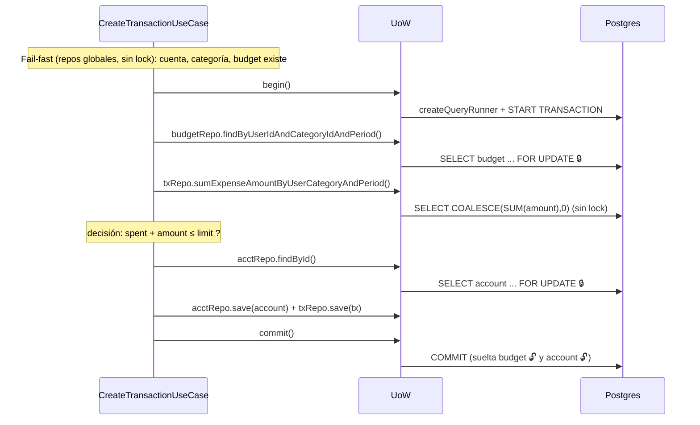
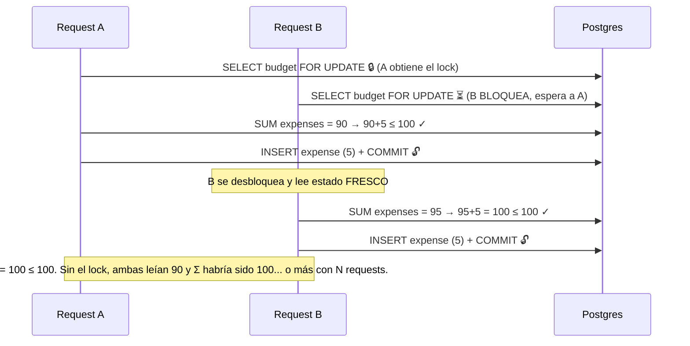

# Modelo de concurrencia

> Documento de referencia y estudio. Reúne en un solo lugar lo que está fragmentado entre
> [CLAUDE.md](../CLAUDE.md) (mapa de locks autoritativo), [uow-decision.md](../src/shared/domain/uow-decision.md)
> (el patrón), [race-conditions-fix-2026-05.md](./history/race-conditions-fix-2026-05.md) (post-mortems
> cross-módulo) y los `notes.md` de cada módulo. Cuando el código y este doc discrepen, gana el
> código — pero abre un PR para corregir el doc.

---

## El modelo en una frase

**Consistencia fuerte en las escrituras (locks pesimistas puntuales), consistencia relajada en las
lecturas (stale reads benignas).** Se paga el costo de coordinación solo donde un error cuesta dinero;
lo que solo se muestra queda barato.

---

## 1. Nivel de aislamiento

**`READ COMMITTED`** — el default de PostgreSQL. El sistema **no** sube a `REPEATABLE READ` ni
`SERIALIZABLE`. Es una decisión, no un descuido:

- `SERIALIZABLE` detectaría los conflictos en el commit y abortaría con `40001` — pero obligaría a
  implementar **retry** en la aplicación.
- En su lugar, el sistema **fabrica la serialización donde la necesita** con locks pesimistas
  explícitos sobre filas concretas. No le pide aislamiento global a Postgres; lo construye puntualmente.

Consecuencia esperada de `READ COMMITTED`: dentro de una misma tx, dos lecturas del mismo row pueden
ver valores distintos (*non-repeatable reads*) y aparecen *phantoms* (filas nuevas en un rango). El
diseño neutraliza esto canalizando todo escritor por una fila-guardián, no subiendo el aislamiento.

---

## 2. Los dos mecanismos

| Problema de concurrencia | Mecanismo | Dónde vive |
| --- | --- | --- |
| **read-modify-write** (lost update, write skew) | `SELECT … FOR UPDATE` (lock pesimista de fila) | scoped repos, dentro del UoW |
| **check-then-insert** (duplicados) | unique constraint + `catch 23505` → excepción de dominio | repos globales (`save()`) |

Regla mental: **read-modify-write → lock. check-then-insert → constraint.** Nunca al revés — no se
puede lockear una fila que todavía no existe, así que la unicidad la garantiza la DB, no un lock.

El lock pesimista se toma al **leer** la fila y **se mantiene hasta el `COMMIT`/`ROLLBACK`**
(two-phase locking) — no hasta que la query retorna. Esto es lo que cubre la escritura posterior:
entre el `findById` y el `commit`, la fila está bloqueada para todos los demás.

> Por eso los scoped repos corren sobre el `manager` del `QueryRunner` (tx abierta) y **no** sobre el
> `DataSource` global (autocommit). En autocommit el `FOR UPDATE` se soltaría apenas termina el SELECT
> y sería inútil. Ver anti-patrón en CLAUDE.md: *"Do not read inside an open UoW with the global repository."*

---

## 3. La frontera transaccional — Unit of Work

Dos implementaciones concretas, separadas por **operación atómica**, no por módulo:

- **`TypeOrmUnitOfWorkImpl`** (`transactions/infrastructure/persistence/unit-of-work.impl.ts`) —
  satisface 3 puertos (`ITransactionUnitOfWork`, `IBudgetUnitOfWork`, `IAccountUnitOfWork`) vía
  `useExisting`. Una instancia `Scope.REQUEST` → un `QueryRunner` → una transacción de PG compartida
  por los tres módulos financieros.
- **`AuthUnitOfWorkImpl`** (`auth/infrastructure/`) — separada: la rotación de refresh tokens no
  comparte invariante con los aggregates financieros.

Una sola impl financiera porque **todo invariante multi-aggregate del dominio está anclado a una
mutación de `Transaction`** (balance, límite, suma de período). Los tres puertos son tres *roles* del
mismo motor transaccional; `useExisting` expresa "mismo objeto, tres contratos angostos". Detalle del
patrón en [uow-decision.md](../src/shared/domain/uow-decision.md).

---

## 4. Mapa de locks

| Lectura (scoped) | Lock | Serializa |
| --- | --- | --- |
| `ScopedAccountRepository.findById` | **FOR UPDATE** | Mutaciones de balance: Create/DeleteTransaction + Archive/Unarchive/Rename (Race 2, Bug B) |
| `ScopedBudgetRepository.findById` | **FOR UPDATE** | UpdateBudgetLimit, DeleteBudget vs creates concurrentes |
| `ScopedBudgetRepository.findByUserIdAndCategoryIdAndPeriod` | **FOR UPDATE** | El gate del invariante de período en CreateTransaction (Bug A) |
| `ScopedTransactionRepository.findById` | **FOR UPDATE** | Doble DELETE de la misma tx (Race 3) |
| `ScopedRefreshTokenRepository.findByTokenHashWithLock` | **FOR UPDATE** | Dos `/refresh` con el mismo token → replay detection |
| `sumExpenseAmountByUserCategoryAndPeriod` | **sin lock** (agregado) | Serializado por el lock del budget tomado antes |
| `ScopedExpenseChecker.hasExpensesInPeriod` / `sumExpenseAmountInPeriod` | **sin lock** (agregado) | Serializado por el lock del budget de Delete/Update |

Los agregados (`SUM`/`COUNT`) **no pueden** tomar `FOR UPDATE` (Postgres lo prohíbe) y tampoco
serviría: un lock sobre filas existentes no frena *phantom inserts* en el rango. Su consistencia la
da el lock de la fila-guardián que el caller toma **primero**.

---

## 5. Un mutex por invariante (no un mutex global)

No existe "el mutex". **Cada invariante tiene su propia fila-guardián**, y un flujo toma un lock por
cada invariante que muta:

| Invariante | Fila-guardián | La lockea |
| --- | --- | --- |
| Σ gastos del período ≤ límite | fila `budgets` del período | CreateTransaction, UpdateBudgetLimit, DeleteBudget |
| Balance de cuenta correcto | fila `accounts` | CreateTransaction, DeleteTransaction, Archive/Unarchive/Rename |
| No doble-reversa de una tx | fila `transactions` | DeleteTransaction |
| No replay de refresh token | fila `refresh_tokens` | RefreshToken |

Por eso `CreateTransaction` toma **dos** locks (budget + account): cruza dos invariantes. El lock del
budget **no** protege el balance — otros flujos (`Archive`, `DeleteTransaction`) mutan la cuenta sin
tocar el budget, así que si no tomaras el lock de la cuenta, un `Archive` concurrente haría lost update
del balance. Cada fila protege contra un conjunto distinto de competidores.

---

## 6. El esqueleto de todo flujo transaccional

```
1. Fail-fast FUERA del UoW (repo global, sin lock): 404/403/400 baratos, no agarra conexión
2. begin()                          — abre QueryRunner + tx
3. findById con FOR UPDATE          — toma el lock de la fila-guardián
4. lecturas dependientes            — agregados; heredan la exclusión del lock de (3)
5. decisión de invariante           — con datos leídos DESPUÉS del lock
6. save() / delete()                — escribe, todavía bajo el lock
7. commit() / rollback() en finally — recién aquí se sueltan TODOS los locks
```

El orden 3→6 **es** la corrección. Lockear la fila-guardián *antes* de leer los datos que entran en la
decisión es lo que cierra la ventana de race.

---

## 7. Los flujos críticos

### `CreateTransaction` (toma DOS locks)

1. **Fuera del UoW:** crea VOs `Amount`/`Nature`; valida cuenta existe+owned; valida categoría
   existe+owned y `nature` coincide (R7); si es expense, valida que existe budget del período (global,
   sin lock). Fail-fast: 404/403/400 sin abrir conexión.
2. `begin()`.
3. **LOCK budget** (solo expense): `budgetRepo.findByUserIdAndCategoryIdAndPeriod` → `FOR UPDATE`.
4. **Lectura dependiente:** `txRepo.sumExpenseAmountByUserCategoryAndPeriod` (sin lock, post-gate).
5. **Decisión:** `spent + amount ≤ limit`? si no → `BudgetLimitExceededException` (422).
6. **LOCK account** + write: `updateBalance` → `acctRepo.findById FOR UPDATE` → recalcula → `save`.
   Luego `txRepo.save(transaction)`.
7. `commit` / `rollback` en finally.

### `DeleteTransaction`

1. **Fuera del UoW:** `GetTransactionByIdUseCase` (global) → 404/403 barato.
2. `begin()`.
3. **LOCK transaction:** `txRepo.findById(id)` → `FOR UPDATE`. Si null (otro la borró y commiteó) →
   `TransactionNotFoundException`.
4. —
5. **Decisión:** revertir un income dejaría balance negativo → `CannotDeleteTransactionException` (409).
6. **LOCK account** + write: `updateBalance` (reverse) → `acctRepo.findById FOR UPDATE`; `txRepo.delete`.
7. `commit` / `rollback`.

### `UpdateBudgetLimit`

1. — (ownership inline).
2. `begin()`.
3. **LOCK budget:** `budgetRepo.findById FOR UPDATE`; ownership inline.
4. **Lectura dependiente:** `expenseChecker.sumExpenseAmountInPeriod` (sin lock, bajo el lock del budget).
5. **Decisión:** `nuevo límite < gastado` → `BudgetLimitBelowSpentException` (409) [B4].
6. `budgetRepo.save`.
7. `commit` / `rollback`.

### `DeleteBudget`

1. — (ownership inline).
2. `begin()`.
3. **LOCK budget:** `budgetRepo.findById FOR UPDATE`; ownership inline.
4. **Lectura dependiente:** `expenseChecker.hasExpensesInPeriod` (sin lock, bajo el lock del budget).
5. **Decisión:** hay gastos en el período → `BudgetHasTransactionsInPeriodException` (409) [Race 1].
6. `budgetRepo.delete`.
7. `commit` / `rollback`.

### `Archive` / `Unarchive` / `Rename` account (los tres, idéntico esqueleto)

1. — (ownership inline).
2. `begin()`.
3. **LOCK account:** `accountRepo.findById FOR UPDATE`; ownership inline. Compite por la misma fila que
   Create/DeleteTransaction [Race 2].
4. —
5. **Decisión:** método de dominio (`archive()` lanza si ya archivada, etc.).
6. `accountRepo.save`.
7. `commit` / `rollback`.

### `RefreshToken` (auth — UoW separado)

1. **Fuera del UoW:** verifica firma del token (`ITokenProvider`) — fail-fast sin tocar DB.
2. `begin()`.
3. **LOCK refresh-token:** `findByTokenHashWithLock FOR UPDATE`.
4. —
5. **Decisión:** null → `InvalidRefreshToken`; revocada → replay → `revokeFamily` + **commit** +
   `RefreshTokenReplayDetected`; expirada → `RefreshTokenExpired`.
6. Inserta el nuevo (misma `familyId`), revoca el viejo (`replacedById = nuevo jti`). Inserta **antes**
   de revocar, por la FK auto-referencial.
7. `commit` / `rollback`.

> **Bug latente (anotado, no activo):** el impl **global** `RefreshTokenRepositoryImpl.findByTokenHashWithLock`
> también pide `pessimistic_write`. Fuera de un `QueryRunner` (conexión en autocommit) eso lanzaría
> `PessimisticLockTransactionRequiredError`. No explota porque está muerto: solo el scoped
> (`ScopedRefreshTokenRepository`, dentro del UoW) lo invoca. Regla: no llamar `findByTokenHashWithLock`
> sobre el repo global.

---

## 8. Orden de locks y deadlocks

Cuando un flujo toma **más de un** lock, el orden importa: dos flujos que tomen los mismos dos locks en
orden inverso pueden hacer deadlock (A espera a B, B espera a A).

Orden de adquisición en el sistema:

- `CreateTransaction`: **budget → account**
- `DeleteTransaction`: **transaction → account**
- el resto: un solo lock

No hay ningún flujo que tome `account → budget` ni `account → transaction`. Es decir, **no hay inversión
de orden** sobre ningún par de filas, así que no hay deadlock por construcción. Si en el futuro se agrega
un flujo multi-lock, debe respetar el mismo orden (la fila de la cuenta se lockea **última**).

---

## 9. Modelo de consistencia: escrituras vs lecturas

### Escrituras → consistencia fuerte

Toda mutación de un invariante pasa por el esqueleto de §6: re-lee bajo `FOR UPDATE` dentro del UoW y
decide sobre datos frescos. No existe path que escriba un balance/límite "puro y bruto" sin antes
lockear y releer. Por eso los read-modify-write son atómicos por construcción.

### Lecturas → stale reads benignas (y es lo correcto)

Los repos **globales** corren en autocommit, `READ COMMITTED`, **sin locks**. Pueden devolver datos
desactualizados — y está bien, por tres razones:

1. **No rompen invariante.** El invariante se hace cumplir al *escribir*, bajo lock, releyendo dentro
   del UoW. Una lectura stale **nunca alimenta una decisión de escritura** → solo puede terminar en una
   pantalla. Si no puede tocar un invariante, no hay nada que arreglar.
2. **Serializar lecturas sería un desastre de rendimiento.** Las lecturas superan a las escrituras por
   órdenes de magnitud. `FOR SHARE` en cada read (o `SERIALIZABLE` global) haría que lectores se
   bloqueen contra escritores y entre sí: cambias milisegundos de staleness benigna por contención
   generalizada.
3. **La ventana es mínima y se autocura.** Dura lo que dura la tx (ms) y la siguiente lectura ve el
   valor committeado.

**Detalle de mecanismo:** un `SELECT` plano **no se bloquea** contra una fila lockeada por `FOR UPDATE`.
En `READ COMMITTED`, lectores no bloquean a escritores ni viceversa. La staleness no es "el read espera y
da datos viejos"; es "el read **no espera** y da el último valor committeado, ignorando el cambio en
vuelo".

**Read-your-own-writes:** la staleness solo aparece entre operaciones **concurrentes** de actores
distintos. Tus propias acciones secuenciales no la ven: la mutación **commitea antes** de responder el
HTTP, así que tu `GET` siguiente ya ve el valor nuevo.

### Dónde se manifiesta la stale read

| Escenario | Qué ves |
| --- | --- |
| `GET /accounts/:id` mientras una transacción se crea (mid-flight) | El balance anterior al inflow/outflow en vuelo |
| `GET /budgets` mientras se crea un expense | El `spent` más bajo de lo que será |
| `GET /transactions` tras un create no committeado de otra request | La nueva tx aún no aparece |
| Pre-checks fail-fast (repo global) | Pueden leer stale — pero se re-verifican bajo lock dentro del UoW |

### Si algún día necesitaras lectura consistente

No subas el aislamiento global. Hazlo **quirúrgico**: esa lectura puntual dentro de una tx
`REPEATABLE READ`, o `FOR SHARE` en ese query, o léela dentro del mismo UoW. Regla: **relajado por
defecto, estricto solo donde se demuestre que importa, y siempre local.**

---

## 10. Diagramas

### Happy path — `CreateTransaction` de un expense



### Dos expenses concurrentes en el mismo período (el lock serializa)



---

## 11. Races históricas (todas cerradas)

| ID | Escenario | Cierre |
| --- | --- | --- |
| Bug A | `PATCH /budgets/:id/limit` vs `POST /transactions` (write skew del límite) | `FOR UPDATE` sobre la fila del budget; create lee por el scoped repo |
| Bug B | Dos `POST /transactions` en la misma cuenta (lost update de balance) | `FOR UPDATE` sobre la fila de la cuenta |
| Bug E | Dos `POST /auth/register` con el mismo email → 500 | `catch 23505` → `UserAlreadyExistsException` (409) |
| Race 1 | `DELETE /budgets/:id` vs `POST /transactions` (TOCTOU) | DeleteBudget bajo UoW; checker bajo el lock del budget |
| Race 2 | `PATCH /accounts/:id/{archive,unarchive,name}` vs mutaciones de tx | los tres bajo `IAccountUnitOfWork`; `findById FOR UPDATE` |
| Race 3 | Dos `DELETE /transactions/:id` (doble-reversa) | `FOR UPDATE` sobre la fila de la tx; fail-fast fuera + re-fetch dentro |
| B4 | `PATCH /budgets/:id/limit` bajaba el límite por debajo de lo gastado | suma bajo el lock del budget → `BudgetLimitBelowSpentException` (409) |

Post-mortems detallados: [race-conditions-fix-2026-05.md](./history/race-conditions-fix-2026-05.md) (Race 1/2)
y los `notes-history.md` de cada módulo (Bug A/A.2/B, Bug E).

---

## 12. Tests de concurrencia

`test/integration/concurrency/concurrency.integration.spec.ts` contra un Postgres real. La técnica:
disparar N requests con `Promise.all` y afirmar sobre el **estado final**, no sobre cada request.

- **Lost update:** N inflows concurrentes → `currentBalance` debe ser la suma exacta (si se pierde un
  update, sale menor).
- **Invariante:** N expenses que rozan el límite → solo los que caben deben pasar (201), el resto 422.
- **Regresión período vacío:** prueba que la serialización viene del lock del *budget* y no de lockear
  filas de gasto preexistentes.
- **Dos operaciones distintas:** `PATCH limit` vs `POST transaction` → exactamente una gana; ninguna 500.

Un `500` bajo carga casi siempre = deadlock o constraint reventada → la serialización falló.

Validado el 2026-06-15: quitando cada lock temporalmente, los tests **se ponen rojos** (account lock →
lost update de balance; budget lock → límite excedido + período vacío; transaction lock → doble reversa
en Race 3). Es decir, los tests **muerden** — no pasan por casualidad.

---

## 13. Fragilidad del diseño (deuda conocida — pendiente de abordar)

El modelo es **correcto pero frágil-por-convención**: su corrección depende de disciplina humana, no de
garantías que el compilador o los tests impongan. Tres grietas documentadas para abordarlas más adelante:

### 13.1 Locks implícitos ("spooky action at a distance")

El `FOR UPDATE` vive *dentro* del `findById` del scoped repo. Desde el call site (`budgetRepo.findById(id)`)
no hay nada que indique que esa línea toma un lock exclusivo. Quien lea el use case no ve el lock — tiene
que saberlo o abrir el impl.

**Riesgo:** un contribuidor que agregue un nuevo flujo de escritura y lea con el repo **global** (en vez
del scoped), o que escriba el balance/budget por un camino que no pase por `findById`, **reabre las races
sin que nada lo detecte**. La regla "no leas dentro del UoW con el repo global" (CLAUDE.md) es la única
barrera, y es prosa, no código.

**Fix robusto (futuro):** exponer el lock en el nombre — `findByIdForUpdate()` en una interfaz escopada
(`IScopedAccountRepository extends IAccountRepository`) devuelta por el UoW. El lock se vuelve visible en
el call site y auto-documentado. Costo: una interfaz escopada por agregado.

### 13.2 Orden de locks no enforced (riesgo de deadlock)

Hoy no hay deadlock porque todos los flujos toman los locks en el mismo orden (**budget → account**, la
cuenta siempre última — ver §8). Pero ese orden es una **convención en la cabeza** del que escribió los
flujos; nada lo impone.

**Riesgo:** un flujo futuro que tome `account → budget` introduce un ciclo AB-BA. Postgres lo detectaría
(`deadlock_timeout` ~1s → aborta una tx con `40P01` → 500), pero recién en producción y bajo carga. El
compilador no dice nada.

**Fix robusto (futuro):** documentar el orden canónico como regla de revisión + idealmente un test de
concurrencia que ejercite el par de flujos en orden inverso para detectar la regresión.

### 13.3 El gate depende de que *todos* los escritores lo respeten

El budget row serializa el SUM del período **solo porque todo escritor de gastos del período toma su
`FOR UPDATE` primero** (§ "bastón de la palabra"). Es un acuerdo, no una imposición física: el lock del
budget no cubre las filas de `transactions`.

**Riesgo:** un flujo que inserte un gasto **sin** pasar por el lock del budget evade el gate y el
invariante "Σ ≤ límite" se rompe silenciosamente.

**Fix robusto (futuro):** canalizar toda creación de gasto por el mismo use case/UoW (hoy se cumple), y
dejar un test que falle si aparece un segundo camino de inserción de gastos.

### Por qué se deja para después

Las tres son correctas **hoy** y el costo de blindarlas (interfaces escopadas, más tests, convenciones
enforced) no se justifica a la escala actual de aprendizaje/portafolio. Se documentan aquí para que la
decisión sea **consciente** y para que el próximo cambio que las toque sepa que está pisando hielo fino.
