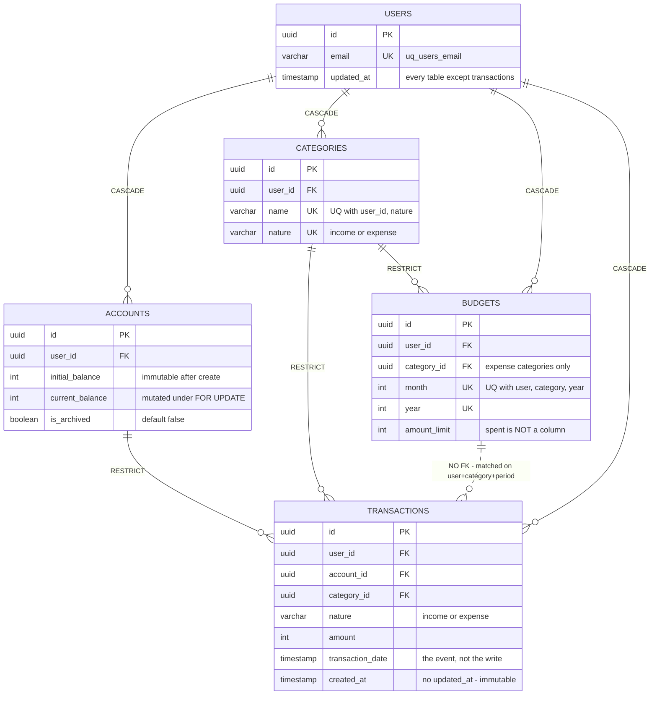

# Data model

- **Last updated:** 2026-08-30

**This is not an ERD.** An ERD generated from the schema would show six tables and every
column, and it would tell you nothing you could not get from `\d+`. What is actually hard
to reconstruct from the schema is the part this document carries:

1. **Which invariant each constraint defends** — and what happens to the caller when it
   fires. This is the write-side mirror of the lock map in
   [`concurrency-model.md`](./concurrency-model.md) §4: that table answers *what
   serializes concurrent writers*, this one answers *what rejects an invalid one*.
2. **Where the relational model and the domain model disagree**, which they do, on
   purpose, in five specific places.
3. **Why `v_period_expenses` exists** — one business definition, one place, three
   consumers.

> When the code and this doc disagree, the code wins — open a PR to fix the doc in the
> same change.

---

## 1. The map

Five aggregates and the relations that carry meaning. Hand-drawn: the columns below are
the ones a constraint or an invariant depends on, not all of them.



Two things in that diagram are the whole point of drawing it by hand:

- **The dashed `BUDGETS ⋯ TRANSACTIONS` line is not a foreign key.** There is no
  `budget_id` on `transactions` and there never was. A transaction belongs to a budget
  only in the sense that `(user_id, category_id, month(transaction_date),
  year(transaction_date))` happens to match a budget row. The relation is *computed*, not
  *declared* — which is exactly why the budget invariant needs a lock (§2) and a shared
  query definition (§4) instead of a constraint.
- **`budgets` has no `spent` column.** Consumption is derived on every read. That is a
  deliberate normalisation choice with a real cost, discussed in §3.

`refresh_tokens` is the sixth table and belongs to `auth`, a different bounded context. It
hangs off `users` (CASCADE) and carries a self-referencing FK, `replaced_by_id`
(`SET NULL`), which turns a rotation family into a linked list. It is kept out of the
diagram above because it shares no relation with the finance aggregates; its constraints
are in the table below.

---

## 2. Constraint map

The mirror of [`concurrency-model.md`](./concurrency-model.md) §4. One row per invariant:
what defends it, in which layer, and what the caller sees when it is violated.

### Defended by the database

These hold even if the application is wrong, bypassed, or running an old build.

| Invariant | Guarded by | Layer | On violation |
| --- | --- | --- | --- |
| One user per email | `uq_users_email` UNIQUE index | DB | `23505` → caught in `UserRepositoryImpl.save()` → `UserAlreadyExistsException` → **409** |
| One category per (user, name, nature) | `UQ_60f3bd4a…` UNIQUE | DB | `23505` → `CategoryRepositoryImpl.save()` → `DuplicateCategoryException` → **409** |
| One budget per (user, category, month, year) | `UQ_budgets_user_category_period` UNIQUE | DB | `23505` → `BudgetRepositoryImpl.save()` → `BudgetAlreadyExistsException` → **409** |
| One row per refresh-token hash | `idx_refresh_tokens_token_hash` UNIQUE | DB | **Not caught** → 500. Deliberate: the hash derives from a JWT with a `uuidv4` `jti`, so a legitimate collision cannot happen; a violation means something is badly wrong and should not be laundered into a 4xx |
| Every row belongs to a real user | FK `user_id` → `users(id)` **CASCADE** (all five tables) | DB | Insert with an unknown `user_id` → `23503`. Deleting a user removes their accounts, categories, budgets, transactions and tokens in one statement |
| A category in use cannot be deleted | FK `category_id` **RESTRICT** from `transactions` and `budgets` | DB | `23503` / `23001` → `CategoryRepositoryImpl.delete()` → `CategoryInUseException` → **409** |
| An account in use cannot be deleted | FK `account_id` **RESTRICT** from `transactions` | DB | `23503` / `23001` → `AccountRepositoryImpl.delete()` → `AccountInUseException` → **409** |
| A rotation pointer never dangles | Self-FK `replaced_by_id` **SET NULL** | DB | The pointer is nulled; the old token row survives and stays auditable |

Both RESTRICT rows catch **two** SQLSTATEs on purpose. PostgreSQL reports `23503`
(`foreign_key_violation`) for `NO ACTION` FKs and `23001` (`restrict_violation`) for
`ON DELETE RESTRICT` on newer versions — local PG 15 emitted the former, the managed
instance in production emits the latter. Catching only one is a 500 that appears solely in
production.

### Defended by the domain (there is no constraint)

Every one of these is a value rule that the database does not know about. See §2.1.

| Invariant | Guarded by | Layer | On violation |
| --- | --- | --- | --- |
| `amount > 0`, integer, finite | `Amount.create()` | Domain VO | `InvalidAmountException` → **400** |
| `amount_limit > 0`, integer, finite | `AmountLimit.create()` | Domain VO | `InvalidAmountLimitException` → **400** |
| `balance ≥ 0`, integer, finite | `Balance.create()` | Domain VO | `InvalidBalanceException` → **400** |
| A balance never goes negative | `Balance.subtract()` | Domain VO | `InsufficientFundsException` → **422** |
| `month ∈ 1…12`, `year > 0` | `Budget.assertValidPeriod()` | Domain entity | `InvalidBudgetMonthException` / `InvalidBudgetYearException` → **400** |
| `nature ∈ {income, expense}` | `TransactionNature` / `CategoryNature` VOs | Domain VO | `Invalid…NatureException` → **400** |
| Email is well-formed and normalised | `Email.create()` (lowercases + trims) | Domain VO | `EmptyEmailException` / `InvalidEmailFormatException` → **400** |
| No write on an archived account | `Account` guards every mutator on `isArchived` | Domain entity | `CannotOperateOnArchivedAccountException` → **409** |

### Defended by the application, under a lock

Cross-aggregate invariants. None of them can be a constraint — they span tables, or they
constrain an aggregate (`SUM`) rather than a row. Their correctness under concurrency
comes from the guardian-row lock the use case takes first; see
[`concurrency-model.md`](./concurrency-model.md) §4 for which lock and §5 for why one per
invariant.

| Invariant | Guarded by | Layer | On violation |
| --- | --- | --- | --- |
| Σ period expenses ≤ budget limit | `CreateTransactionUseCase`, under `FOR UPDATE` on the budget row, summing `v_period_expenses` | Application + lock | `BudgetLimitExceededException` → **422** |
| A new limit is never below what is already spent | `UpdateBudgetLimitUseCase`, same budget-row lock | Application + lock | `BudgetLimitBelowSpentException` → **409** |
| A budget with expenses in its period cannot be deleted | `DeleteBudgetUseCase` → `hasExpensesInPeriod`, same budget-row lock | Application + lock | `BudgetHasTransactionsInPeriodException` → **409** |
| An expense requires a budget for its period | `CreateTransactionUseCase` — checked twice: once as a cheap pre-flight, once inside the UoW under the lock | Application + lock | `BudgetRequiredForExpenseTransactionException` → **409** |
| Account balance stays equal to its transaction history | `FOR UPDATE` on the account row in `ScopedAccountRepository.findByIdWithLock` | Lock | No exception — this one is *serialization*, not rejection. Bug B in [`closed-race-conditions.md`](./history/closed-race-conditions.md) |
| Deleting a transaction never drives a balance negative | `DeleteTransactionUseCase` translates `InsufficientFundsException` | Application + lock | `CannotDeleteTransactionException` → **409** |
| A budget's category is an expense category | `CreateBudgetUseCase` | Application | `BudgetCategoryMustBeExpenseException` → **409** |
| A transaction's nature matches its category's | `CreateTransactionUseCase` | Application | `IncompatibleCategoryNatureException` → **400** |
| Every row a request touches belongs to the caller | `@CurrentUser()` + per-use-case ownership check | HTTP + application | `ResourceOwnershipException` → **403** |

The full exception → HTTP table is in
[`conventions.md`](./conventions.md#exception--http-mapping); it is the source of truth
for the right-hand column above.

### 2.1 There is not a single `CHECK` constraint

That is a real, deliberate asymmetry and it is worth stating outright rather than leaving
a reader to notice it: `amount > 0`, `amount_limit > 0`, `current_balance >= 0` and
`nature IN ('income','expense')` are all expressible as `CHECK` constraints, and none of
them is one.

**Why.** The value rules live in value objects that are already the only construction path
— `Amount.create()` is unavoidable, because `Transaction` cannot be built without an
`Amount`. Adding a `CHECK` would duplicate the rule in a second language, where it can
drift, and buy a redundant guarantee against a writer that does not exist: every write
goes through TypeORM through a mapper through the domain. The uniqueness rules are
different in kind and *do* get constraints, because they defend against **concurrency**,
not against bad input: two valid requests racing is the failure mode, and no amount of
in-process validation closes it (see `concurrency-model.md` §2 — *read-modify-write → lock,
check-then-insert → constraint*).

**What it costs.** A `psql` session, a data migration, or a future second service can
insert a negative amount and nothing stops it. That is the accepted risk, and the honest
version of the trade-off is that it is accepted because there is exactly one writer today
— not because a `CHECK` would be wrong.

**Where it leaks.** `Email.create()` lowercases before saving, so emails are effectively
case-insensitive — but `uq_users_email` is a plain index on a default-collation column,
which makes the *database* guarantee case-**sensitive**. `Ana@x.cl` and `ana@x.cl` are two
different rows as far as Postgres is concerned; they cannot both exist only because every
write path normalises first. A `CREATE UNIQUE INDEX ON users (lower(email))` would move
that guarantee into the schema. Today it is a domain invariant wearing a database
constraint's clothes.

---

## 3. Where the relational model and the domain model diverge

Two models, mapped by hand, on purpose ([ADR-0001](./adr/0001-ports-as-abstract-classes.md),
[`conventions.md`](./conventions.md)). The mapper in each module's
`infrastructure/persistence/` is the only translator. These are the five places where the
translation is not mechanical — the impedance mismatch, concretely.

### 3.1 Value objects flatten into scalar columns

`Amount`, `Balance`, `AmountLimit`, `Email`, `TransactionNature`, `CategoryNature` and
`AccountType` are all classes in the domain and all plain `int` / `varchar` in the schema.
Nothing in the database records that `transactions.amount` is an `Amount` rather than an
integer that happens to be positive.

The direction that matters is the way back: mappers call **`VO.reconstitute()`, never
`VO.create()`**. Persisted data was validated on the way in; re-validating it on the way
out means a rule tightened in 2027 retroactively makes 2026's rows unreadable, and the
failure surfaces as a 500 on a `GET`. This is a standing anti-pattern in
[`conventions.md`](./conventions.md#anti-patterns--do-not-do), and it is a direct
consequence of the flattening: if the column carried the type, there would be nothing to
re-validate.

### 3.2 The `Budget` aggregate spans two tables, and only one of them is `budgets`

The domain concept "a budget" is *limit and consumption*. The `budgets` table stores only
the limit. Consumption is `SUM(amount)` over `transactions` for the matching user,
category and period — a different table, joined by no foreign key, computed on every read.

This is the single largest divergence in the system, and everything else about the budget
flow follows from it:

- it is why the invariant needs a **lock** rather than a constraint — you cannot write a
  `CHECK` over rows of another table;
- it is why the lock is taken on the **budget row**, which acts as a guardian for a set of
  transaction rows that do not exist yet (a `FOR UPDATE` over the existing transactions
  would not block a phantom insert);
- it is why `v_period_expenses` has to exist (§4).

The alternative — a denormalised `spent` column — turns two reads into one at the cost of a
write on `budgets` for every transaction, plus a reconciliation story for when the two
disagree. Not taken.

### 3.3 `Account` holds one `Balance` type in two columns

`initial_balance` is `private readonly` in the entity, so it never *changes* after
`create()` (TypeORM still writes the column on every `UPDATE`, always with the same value);
`current_balance` is private and mutable, changed only through `inflow()` / `outflow()`.
The schema shows two `int` columns of equal standing and no hint that one is immutable.
The invariant "initial balance never changes" exists only in the `readonly` modifier — a
compile-time guarantee that vanishes at the driver boundary.

### 3.4 `transactions` has no `updated_at`, and that is not an omission

Every other table has one. `Transaction` has no mutator methods at all: the domain class
exposes nine `public readonly` fields, `create()` and `reconstitute()`, and nothing else.
Editing a transaction means deleting it and creating a new one, which is also what keeps
the account balance reversible ([ADR-0005](./adr/0005-single-entry-immutable-transactions.md)).

A column that can never change is worse than absent — it invites a writer. Its absence is
the schema telling you the row is a ledger entry.

Note the two timestamps it *does* have are not redundant either: `transaction_date` is
when the money moved, `created_at` is when the row was written. Recording yesterday's
coffee today makes them differ, and reports key off the first while auditing keys off the
second.

### 3.5 Domain concepts with no table at all

- **A refresh-token *family*** is a first-class concept in the auth domain — replay
  detection revokes the whole family ([ADR-0004](./adr/0004-refresh-token-rotation.md)).
  It has no `families` table: it is a `family_id` column repeated across rows, plus the
  `replaced_by_id` linked list. Revoking a family is a single
  `UPDATE … WHERE family_id = $1 AND revoked_at IS NULL`.
- **A period** (`{start, end}`) is a domain type, `monthPeriod(year, month)` in
  `shared/domain/`. In the schema it is two loose `int` columns on `budgets` and a
  half-open range in every `WHERE`. Nothing in the database knows that `month` and `year`
  belong together, which is why the uniqueness constraint has to name all four columns.
- **Ownership** is expressed relationally as a `user_id` FK, but the security rule
  ("`userId` always comes from `@CurrentUser()`") is not derivable from it. The FK stops
  an *orphan*; it does nothing about a caller passing someone else's `user_id`. That is
  application-layer, always, and it is why the rule is stated as a security rule and not a
  style preference.

---

## 4. Why `v_period_expenses` exists

```sql
CREATE VIEW "v_period_expenses" AS
  SELECT "id", "user_id", "category_id", "account_id", "amount", "transaction_date"
  FROM "transactions"
  WHERE "nature" = 'expense';
```

Six columns and a `WHERE`. It exists for one reason, and it is not performance — the
planner inlines it and the query plan is identical with or without it
([`performance.md`](../performance.md) §2).

### The business definition

The view **is** the system's answer to *"what counts as spending?"* Today that answer is
`nature = 'expense'`. Tomorrow it might exclude reversals, or transfers between the user's
own accounts, or refunds. The point is that it is a **business rule that will change**, not
a filter that happens to appear in some queries.

### One place

Before this view existed, that predicate was written out in each query that needed it. The
failure mode is not that one of them is slow — it is that one of them gets updated and the
others do not, and then **the path that reports and the path that enforces the limit
disagree**. The user is told they have spent $180.000 of their $200.000 limit, and the next
$10.000 expense is rejected, because the enforcement query counts something the report
does not. There is no error, no stack trace, and no way to reproduce it from the outside:
the system is simply lying, consistently, to one of the two callers.

That is the same class of bug as `isBudgetable` — a derived fact stored in a second place,
free to drift from the first — which is why `isBudgetable` is a standing "never
reintroduce" rule in `CLAUDE.md`. A view makes the drift impossible by construction: there
is one definition, and changing it changes every consumer in the same statement.

### Three consumers

| Consumer | Path | What it asks | Lock |
| --- | --- | --- | --- |
| **Enforcement — create** | `TypeOrmUnitOfWorkImpl` → `sumPeriodExpenses()`, reached as `ctx.transactions.sumExpenseAmountByUserCategoryAndPeriod` | "Σ spent this period, so I can reject the expense that would exceed the limit" | none (aggregate); serialized by the budget-row `FOR UPDATE` the caller already holds |
| **Enforcement — update / delete** | `ScopedExpenseChecker.sumExpenseAmountInPeriod` → the same `sumPeriodExpenses()`; and `hasExpensesInPeriod`, a `COUNT(*)` on the view | "Σ spent, so a lowered limit cannot land below it" · "are there any expenses, so this budget cannot be deleted" | none (aggregate); same budget-row lock |
| **Reporting** | `ReportsReadStoreImpl.getPeriodTotals` → `GET /reports/summary` | "Σ spent this period, to show the user" | none, and no transaction — a benign stale read by design |

The `SUM` itself is one function,
`shared/infrastructure/persistence/period-expenses.query.ts`, shared by the first two
consumers. It used to exist twice, character for character, in `transactions` and in
`budgets`; unifying it was P6 in
[`structural-refactors.md`](./history/structural-refactors.md). The port methods kept their
different names because each documents its own caller's question, not the query.

So the guarantee is layered, and both layers are load-bearing: **the view unifies the
definition of an expense; the shared function unifies the sum over it.** Reporting reads the
view directly, because it asks a different question (all categories, no category filter) of
the same definition.

### Two properties worth knowing before touching it

- **It is not a `@ViewEntity`.** TypeORM only manages views registered in
  `typeorm_metadata`; one created by raw SQL is invisible to `migration:generate`
  (verified with a dry run), so a generated migration will never propose to drop or
  recreate it. That is the point — but it also means **`synchronize` will not create it**.
  A database built from entities alone has no `v_period_expenses` and every budget flow
  fails at the first query. Same policy as the partial index in
  [ADR-0013](./adr/0013-period-sum-index.md): database objects that TypeORM cannot model
  declaratively are managed by hand-written migration only
  ([ADR-0007](./adr/0007-migrations-over-synchronize.md)).
- **It inlines, so the lock model is unchanged.** Reading through the view on the UoW's
  `EntityManager` is the same transaction, the same snapshot, and the same serialization
  guarantee as reading the table. `docs/perf/` has the plans.
- **`income` is deliberately not a view.** It has exactly one consumer (the report), so
  there is nothing to keep consistent. If a second one appears, `v_period_incomes` follows
  the same pattern — YAGNI until then.

---

## 5. Where to go next

| You want… | Read |
| --- | --- |
| What serializes concurrent writers | [`concurrency-model.md`](./concurrency-model.md) §4 |
| The exception → HTTP table this document's last column cites | [`conventions.md`](./conventions.md#exception--http-mapping) |
| Why the schema comes from migrations and never `synchronize` | [ADR-0007](./adr/0007-migrations-over-synchronize.md) |
| Why transactions are immutable and single-entry | [ADR-0005](./adr/0005-single-entry-immutable-transactions.md) |
| Why the period-sum query has the index it has | [ADR-0013](./adr/0013-period-sum-index.md) · [`performance.md`](../performance.md) §2 |
| The races these constraints and locks closed | [`history/closed-race-conditions.md`](./history/closed-race-conditions.md) |
