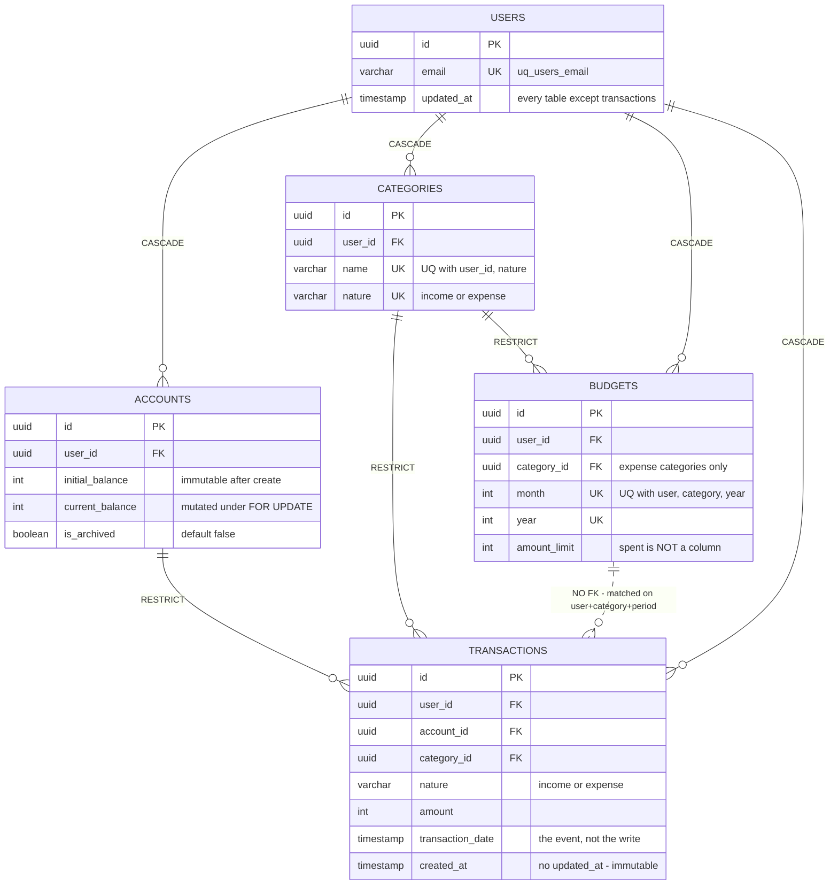

# Data model

- **Last updated:** 2026-08-30

**This is not an ERD.** One generated from the schema would show six tables and every
column, and tell you nothing `\d+` would not. What is hard to reconstruct from the
schema is what this document carries: which invariant each constraint defends, where the
relational and domain models deliberately disagree, and why `v_period_expenses` exists.

It is the write-side mirror of the lock map in
[`concurrency-model.md`](./concurrency-model.md) §4 — that table answers what serializes
concurrent writers, this one answers what rejects an invalid one.

> When the code and this doc disagree, the code wins — open a PR to fix the doc in the
> same change.

---

## 1. The map

Five aggregates and the relations that carry meaning. Hand-drawn: only the columns a
constraint or an invariant depends on.



Two things in it are the whole point of drawing it by hand:

- The dashed `BUDGETS ⋯ TRANSACTIONS` line is not a foreign key. There is no `budget_id`
  on `transactions` and there never was. A transaction belongs to a budget only in the
  sense that `(user_id, category_id, month(transaction_date), year(transaction_date))`
  matches a budget row. The relation is computed, not declared — which is why the budget
  invariant needs a lock (§2) and a shared query definition (§4) instead of a
  constraint.
- `budgets` has no `spent` column. Consumption is derived on every read (§3.1).

`refresh_tokens` is the sixth table and belongs to `auth`, a different bounded context.
It hangs off `users` (CASCADE) with a self-FK `replaced_by_id` (SET NULL) that turns a
rotation family into a linked list.

---

## 2. Constraint map

Which layer an invariant lands in is decided by the shape of the write that can break it:

| The write is… | The invariant lives in… | Because |
| --- | --- | --- |
| A value being constructed | A domain value object | The rule is about one value in isolation, and the factory is the only construction path |
| Check-then-insert | A database constraint | Two valid requests can race between check and insert; no in-process validation closes that window |
| Read-modify-write over a set | An application check under a lock | The rule spans tables or constrains a SUM, so it cannot be a constraint — and a phantom insert defeats any unserialized read-side guard |

### Defended by the database

Holds even if the application is wrong, bypassed, or running an old build.

| Invariant | Guarded by | On violation |
| --- | --- | --- |
| One user per email | `uq_users_email` UNIQUE | `23505` → `UserAlreadyExistsException` → **409** |
| One category per (user, name, nature) | `UQ_60f3bd4a…` UNIQUE | `23505` → `DuplicateCategoryException` → **409** |
| One budget per (user, category, month, year) | `UQ_budgets_user_category_period` UNIQUE | `23505` → `BudgetAlreadyExistsException` → **409** |
| One row per refresh-token hash | `idx_refresh_tokens_token_hash` UNIQUE | Not caught → **500**. The hash derives from a JWT with a `uuidv4` `jti`, so a legitimate collision cannot happen; a violation means something is badly wrong and should not be laundered into a 4xx |
| Every row belongs to a real user | FK `user_id` CASCADE (all five tables) | `23503`. Deleting a user removes everything they own in one statement |
| A category or account in use cannot be deleted | FK RESTRICT from `transactions` / `budgets` | `23503` / `23001` → `CategoryInUseException` · `AccountInUseException` → **409** |
| A rotation pointer never dangles | Self-FK `replaced_by_id` SET NULL | Pointer nulled; the old row survives and stays auditable |

Both RESTRICT rows catch two SQLSTATEs on purpose: PostgreSQL reports `23503` for
`NO ACTION` FKs and `23001` for `ON DELETE RESTRICT` on newer versions. Local PG 15
emitted the former, the managed instance emits the latter — catching only one is a 500
that appears exclusively in production.

### Defended by the domain

Every value rule lives in the value object that is the only way to build the value:
`Amount`, `AmountLimit` and `Balance` reject non-positive, non-integer and non-finite
values; `Balance.subtract()` raises `InsufficientFundsException` (**422**) rather than
going negative; `TransactionNature` / `CategoryNature` constrain the enum;
`Email.create()` normalises and validates; `Budget.assertValidPeriod()` bounds month and
year; and `Account` guards every mutator on `isArchived` (**409**). The rest surface as
**400**. Full mapping in [`conventions.md`](./conventions.md).

There is no CHECK constraint anywhere, and that asymmetry is deliberate. A CHECK would
restate a rule that already has a single enforcement point, in a second language where it
can drift, to guard against a writer that does not exist — every write goes through
TypeORM, through a mapper, through the domain. Uniqueness rules are different in kind and
do get constraints, because they defend against concurrency rather than bad input. The
accepted cost: a `psql` session or a future second service can insert a negative amount
and nothing stops it. It is accepted because there is exactly one writer today, not
because a CHECK would be wrong.

Where that leaks: `Email.create()` lowercases before saving, but `uq_users_email` is a
plain index on a default-collation column, so the database guarantee is case-sensitive.
`Ana@x.cl` and `ana@x.cl` are two different rows as far as Postgres is concerned; they
cannot both exist only because every write path normalises first.
`CREATE UNIQUE INDEX ON users (lower(email))` would move that guarantee into the schema.
Today it is a domain invariant wearing a database constraint's clothes.

### Defended by the application, under a lock

Cross-aggregate invariants: they span tables or constrain a SUM, so none can be a
constraint. Correctness under concurrency comes from the guardian-row lock the use case
takes first — see [`concurrency-model.md`](./concurrency-model.md) §4.

| Invariant | Guarded by | On violation |
| --- | --- | --- |
| Σ period expenses ≤ budget limit | `CreateTransactionUseCase`, under `FOR UPDATE` on the budget row | `BudgetLimitExceededException` → **422** |
| A new limit is never below what is already spent | `UpdateBudgetLimitUseCase`, same lock | `BudgetLimitBelowSpentException` → **409** |
| A budget with expenses in its period cannot be deleted | `DeleteBudgetUseCase` → `hasExpensesInPeriod`, same lock | `BudgetHasTransactionsInPeriodException` → **409** |
| An expense requires a budget for its period | `CreateTransactionUseCase` — cheap pre-flight, then again inside the UoW under the lock | `BudgetRequiredForExpenseTransactionException` → **409** |
| Account balance stays equal to its transaction history | `FOR UPDATE` on the account row in `findByIdWithLock` | No exception — serialization, not rejection. Bug B in `closed-race-conditions.md` |
| Deleting a transaction never drives a balance negative | `DeleteTransactionUseCase` | `CannotDeleteTransactionException` → **409** |
| A budget's category is an expense category | `CreateBudgetUseCase` | `BudgetCategoryMustBeExpenseException` → **409** |
| A transaction's nature matches its category's | `CreateTransactionUseCase` | `IncompatibleCategoryNatureException` → **400** |
| Every row a request touches belongs to the caller | `@CurrentUser()` + per-use-case ownership check | `ResourceOwnershipException` → **403** |

---

## 3. Where the two models diverge

Mapped by hand, on purpose ([ADR-0001](./adr/0001-ports-as-abstract-classes.md)). The
mapper in each module's `infrastructure/persistence/` is the only translator. Two
divergences are load-bearing; three are worth knowing.

### 3.1 The Budget aggregate spans two tables, and only one of them is budgets

The domain concept is limit and consumption. The table stores only the limit. Consumption
is `SUM(amount)` over transactions for the matching user, category and period — another
table, joined by no foreign key, computed on every read.

Everything about the budget flow follows from this: the invariant needs a lock because you
cannot write a CHECK over rows of another table; the lock is taken on the budget row,
which guards a set of transaction rows that do not exist yet (a `FOR UPDATE` over
existing transactions would not block a phantom insert); and `v_period_expenses` has to
exist (§4). The alternative — a denormalised `spent` column — turns two reads into one at
the cost of a write on budgets per transaction, plus a reconciliation story for when the
two disagree. Not taken.

### 3.2 transactions has no updated_at, and that is not an omission

Every other table has one. `Transaction` has no mutator methods at all: nine `public
readonly` fields, `create()`, `reconstitute()`. Editing means deleting and recreating,
which is what keeps the balance reversible
([ADR-0005](./adr/0005-single-entry-immutable-transactions.md)). A column that can never
change is worse than an absent one — it invites a writer. Its absence is the schema
showing you the row is a ledger entry.

The two timestamps it does have are not redundant: `transaction_date` is when the money
moved, `created_at` is when the row was written. Recording yesterday's coffee today makes
them differ; reports key off the first, auditing off the second.

### 3.3 Three smaller ones

- Value objects flatten into scalars. Nothing in the schema records that
  `transactions.amount` is an `Amount`. The direction that matters is the way back:
  mappers call `VO.reconstitute()`, never `VO.create()` — re-validating persisted data
  means a rule tightened in 2027 retroactively makes 2026's rows unreadable, surfacing as
  a 500 on a GET. Standing anti-pattern in `conventions.md`.
- `initial_balance` is immutable and the schema cannot say so. It is `private readonly` in
  the entity; the schema shows two `int` columns of equal standing. The invariant lives in
  a compile-time modifier that evaporates at the driver boundary.
- Some domain concepts have no table. A refresh-token family is a `family_id` repeated
  across rows plus the `replaced_by_id` list
  ([ADR-0004](./adr/0004-refresh-token-rotation.md)). A period is two loose `int`
  columns — nothing in the database knows month and year belong together, which is why the
  uniqueness constraint names all four. Ownership is a `user_id` FK, but the FK stops an
  orphan; it does nothing about a caller passing someone else's `user_id`. That is
  application-layer, always.

---

## 4. Why v_period_expenses exists

```sql
CREATE VIEW "v_period_expenses" AS
  SELECT "id", "user_id", "category_id", "account_id", "amount", "transaction_date"
  FROM "transactions"
  WHERE "nature" = 'expense';
```

Six columns and a WHERE, and the reason is not performance — the planner inlines it and
the plan is identical either way ([`performance.md`](../performance.md) §2).

The view is the system's answer to "what counts as spending?" Today that is
`nature = 'expense'`; tomorrow it might exclude reversals, transfers between the user's
own accounts, or refunds. It is a business rule that will change, not a filter that
happens to appear in several queries.

Before it existed, that predicate was written out in each query that needed it. The
failure mode is not that one is slow — it is that one gets updated and the others do not,
and then the path that reports and the path that enforces the limit disagree. The user is
told they have spent 180,000 of a 200,000 limit and the next 10,000 expense is rejected,
because enforcement counts something the report does not. No error, no stack trace, no way
to reproduce from the outside: the system is simply lying, consistently, to one of the two
callers. Same class of bug as `isBudgetable`, which is why that one is a standing "never
reintroduce" rule.

Three consumers share it: enforcement on create (summed inside the UoW under the
budget-row lock), enforcement on update/delete (`sumExpenseAmountInPeriod` and
`hasExpensesInPeriod`, same lock), and reporting (`GET /reports/summary`, no transaction —
a benign stale read by design). The SUM itself is one function,
`shared/infrastructure/persistence/period-expenses.query.ts`, shared by the first two; it
existed twice, character for character, until P6 in `structural-refactors.md`. So the
guarantee is layered and both layers are load-bearing: the view unifies the definition of
an expense; the shared function unifies the sum over it.

Two properties before touching it:

- It is not a `@ViewEntity`, so `migration:generate` cannot see it (verified with a dry
  run) and will never propose to drop it. That is the point — but it also means
  `synchronize` will not create it, and a database built from entities alone fails at the
  first budget query. Same policy as the partial index in
  [ADR-0013](./adr/0013-period-sum-index.md): objects TypeORM cannot model declaratively
  are managed by hand-written migration only
  ([ADR-0007](./adr/0007-migrations-over-synchronize.md)).
- It inlines, so reading through it on the UoW's `EntityManager` is the same transaction,
  snapshot and serialization guarantee as reading the table.

`income` is deliberately not a view: one consumer, nothing to keep consistent. YAGNI until
a second appears.
